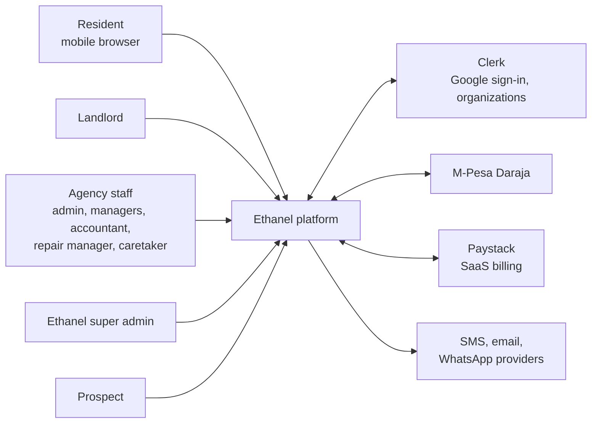
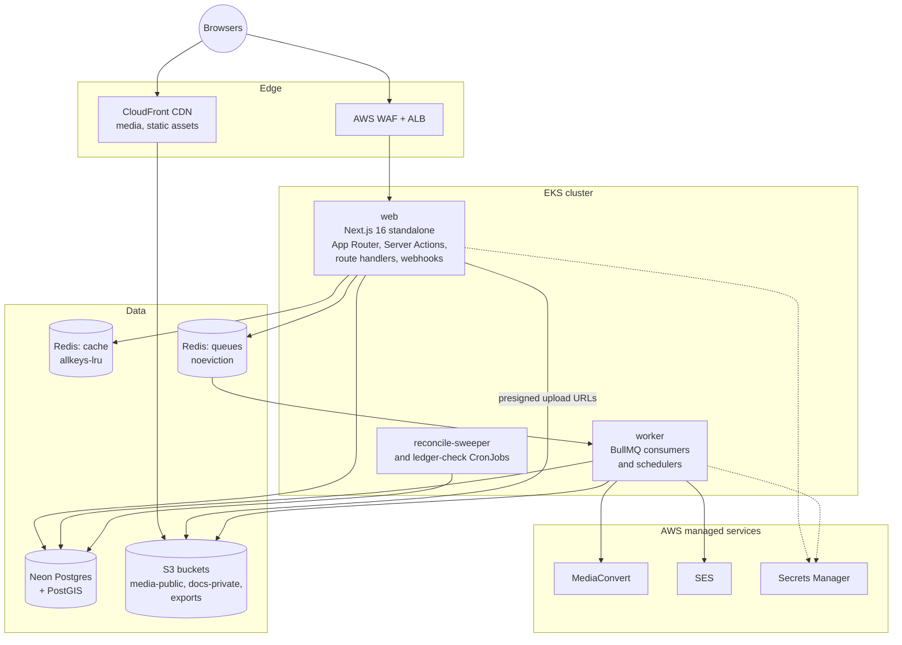
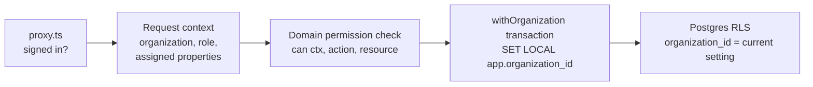
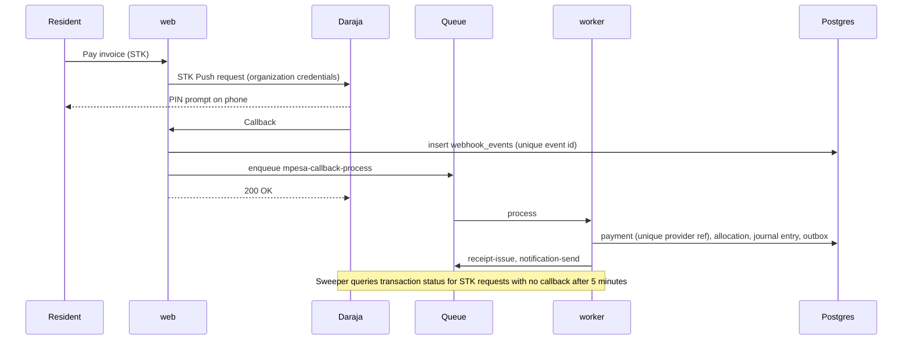
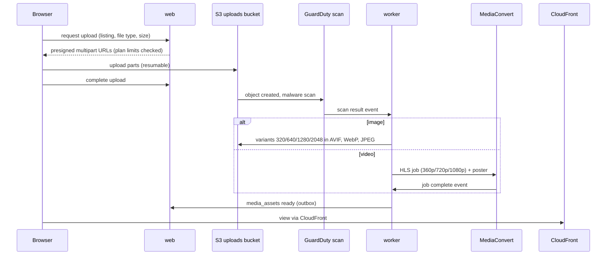
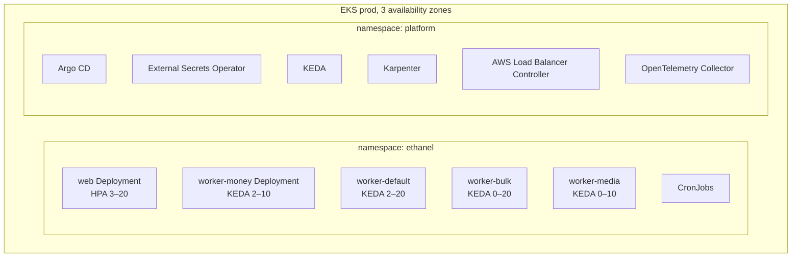
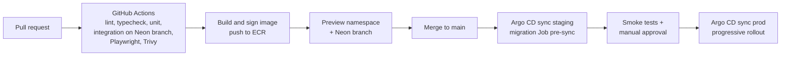

# Ethanel — Architecture v1.1

| | |
|---|---|
| **Date** | 15 September 2026 |
| **Landlord** | Njuguna Njenga (Cpt. N) |
| **Companion** | Ethanel PRD v1.1 |
| **Change log** | 1.1: organization/resident/landlord naming, verified WhatsApp numbers, outside view at near-zero cost, 360° photos, video viewings, WhatsApp channel, e-signature, AI, eTIMS, land projects, minimum pilot platform (§11.0) |
| **Scope** | Release 1 platform: web app, background workers, data, integrations, Kubernetes deployment. Landing page out of scope |

---

## 1. Architecture principles

1. **Modular monolith first.** One Next.js 16 application and one worker service share a typed domain layer. Modules have strict boundaries (own tables, own public service interface) so they can be extracted into services when load or team size demands it, not before.
2. **Money is correct before it is fast.** Rent, expenses and landlord balances run on an append-only double-entry ledger. Every payment integration is idempotent.
3. **Isolation in two layers.** Every query is scoped to a organization in the data access layer, and Postgres row-level security blocks anything the application misses.
4. **Asynchronous by default for side effects.** Notifications, reconciliation, report exports, media processing and billing run as queued jobs with retries.
5. **Stateless pods.** No local disk state; shared cache in Redis; files in object storage.
6. **Kubernetes-portable, cloud-pragmatic.** Workloads are plain Kubernetes; managed cloud services are used where operating them ourselves adds risk.
7. **Everything as code.** Terraform for cloud, Helm for workloads, Argo CD for delivery, Drizzle migrations for schema.

## 2. System context



## 3. Cloud decision: AWS recommended

The founder allowed AWS or GCP. The deciding factor is the database.

- **Neon now runs only on AWS.** Its Azure regions were deprecated in April 2026 and it has no GCP regions. Running the cluster on GCP would put every database round trip across clouds and the public internet, adding latency to every request and egress cost to every query.
- A GCP deployment is still viable but should swap Neon for Cloud SQL or AlloyDB for PostgreSQL, losing Neon branching for preview environments.

| Concern | AWS (recommended) | GCP alternative |
|---|---|---|
| Kubernetes | Amazon EKS with Karpenter | GKE Autopilot |
| PostgreSQL | **Neon** in the same AWS region | Cloud SQL or AlloyDB (no Neon) |
| Redis-compatible cache and queues | Amazon ElastiCache (Valkey or Redis OSS) | Memorystore for Redis or Valkey |
| Object storage and CDN | S3 + CloudFront | Cloud Storage + Cloud CDN |
| Video transcoding | AWS Elemental MediaConvert | Transcoder API |
| Secrets | Secrets Manager + External Secrets Operator | Secret Manager + External Secrets Operator |
| Email | Amazon SES | Third-party provider |
| Malware scanning of uploads | GuardDuty Malware Protection for S3 | ClamAV job or third-party |
| Container registry | ECR | Artifact Registry |
| WAF | AWS WAF | Cloud Armor |

**Region:** place EKS, ElastiCache and S3 in the same AWS region as the Neon project. Choose among Neon's AWS regions by measuring latency from Nairobi (Europe is typically the closest Neon-supported option; confirm with real measurements before creating the production project, because a Neon project's region cannot be changed later). CloudFront serves media from edge locations close to users.

## 4. Container view



| Deployable | Responsibility | Scaling |
|---|---|---|
| `web` | All UI (resident, landlord, staff, super admin), Server Actions, REST route handlers for webhooks (M-Pesa, Paystack, Clerk, WhatsApp) and exports download | HPA on CPU and requests per pod; min 3 replicas across 3 AZs |
| `worker` | Queue consumers: notifications, reconciliation, invoice generation, statements, report exports, media processing, metering, billing, dunning | KEDA on queue depth; separate Deployments per queue class (critical-money, default, bulk) |
| CronJobs | Nightly metering snapshot, ledger integrity check, reconciliation sweeper, data retention | Kubernetes CronJob |

**Why webhooks live in `web`:** payment callbacks must be acknowledged fast. The handler verifies, stores the raw payload, enqueues a job and returns 200 within milliseconds; processing happens in `worker`. A separate ingest service can be split out later without changing contracts.

## 5. Application architecture

### 5.1 Monorepo layout

```
ethanel/
├─ apps/
│  ├─ web/                    # Next.js 16 (App Router)
│  │  ├─ app/
│  │  │  ├─ (auth)/           # Clerk sign-in / sign-up
│  │  │  ├─ (resident)/r/…    # resident app
│  │  │  ├─ (landlord)/l/…    # landlord portal
│  │  │  ├─ (org)/w/[orgSlug]/…   # staff app
│  │  │  ├─ (caretaker)/c/…   # PWA task screens
│  │  │  ├─ (admin)/admin/…   # super admin
│  │  │  └─ api/webhooks/{mpesa,paystack,clerk,whatsapp}/route.ts
│  │  └─ proxy.ts             # clerkMiddleware route protection
│  └─ worker/                 # BullMQ processors and schedulers
├─ packages/
│  ├─ domain/                 # modules: portfolio, leasing, billing, ledger,
│  │                          # maintenance, reporting, marketplace, saas-billing
│  ├─ db/                     # Drizzle schema, migrations, RLS policies, seed
│  ├─ auth/                   # Clerk helpers, permission checks, organization context
│  ├─ integrations/           # mpesa, paystack, sms, email, whatsapp, media
│  ├─ ui/                     # design system (Tailwind + shadcn/ui), data grid
│  └─ config/                 # eslint, tsconfig, env schema (zod)
├─ infra/terraform/           # VPC, EKS, ElastiCache, S3, CloudFront, IAM, SES
├─ deploy/helm/               # charts for web, worker, cronjobs
├─ deploy/argocd/             # app-of-apps per environment
├─ docs/                      # PRD.md, ARCHITECTURE.md, ADRs
└─ .claude/                   # agents, commands (repo kit)
```

### 5.2 Module boundaries

| Module | Owns | Publishes events |
|---|---|---|
| `portfolio` | landlords, management agreements, properties, units, assignments | `unit.status_changed` |
| `leasing` | residents, leases, deposits, inspections | `lease.activated`, `lease.ended` |
| `billing` | invoices, charges, meter readings, payments, allocations, receipts, reminders | `invoice.issued`, `payment.received`, `payment.matched` |
| `ledger` | accounts, journal entries, balances | `journal.posted` |
| `costs` | expenses, recurring costs, approvals | `expense.approved` |
| `landlord-accounting` | periods, statements, remittances | `statement.issued` |
| `maintenance` | repair requests, work orders, SLAs | `repair.status_changed` |
| `reporting` | read models, exports, saved views | `export.ready` |
| `marketplace` | listings, media, storefronts, viewings, leads, calendar links | `listing.published`, `lead.qualified`, `viewing.confirmed` |
| `land` (1.1) | land projects, plots, reservations, sale transactions and milestones | `plot.reserved`, `milestone.completed` |
| `messaging` | WhatsApp conversations, templates, verification codes, SMS fallback | `message.received` |
| `signatures` | signature requests, certificates | `document.signed` |
| `tax` (1.1) | eTIMS invoices | `etims.issued` |
| `saas-billing` | plans, entitlements, usage, subscription invoices | `entitlements.changed` |
| `platform` | organizations, memberships mirror, audit log, support sessions | `organization.created` |

Rules: a module reads other modules only through their exported service functions; no cross-module table joins outside `reporting` read models; events go through the outbox (§8.3).

### 5.3 Request path in `web`

1. `proxy.ts` (Clerk middleware) rejects unauthenticated access to protected route groups. It is a coarse gate only.
2. Server Component or Server Action calls `getRequestContext()`: Clerk `auth()` → user ID, active organization ID and permissions → Ethanel organization ID, role, assigned property IDs (cached in Redis for 60 s, invalidated on assignment changes).
3. Domain service checks permission (for example `can(ctx, 'expense.approve', property)`).
4. Data access runs inside `withOrganization(ctx, tx => …)`, which opens a transaction and sets `SET LOCAL app.organization_id` and `app.user_id` so RLS policies apply.
5. Writes append audit entries and outbox events in the same transaction.

### 5.4 Caching strategy

| Layer | What | Where | Invalidation |
|---|---|---|---|
| Next.js `"use cache"` | Plan catalogue, report definitions, marketplace listing pages (R2 public) | Shared Redis via `cacheHandlers` | `revalidateTag` / `updateTag` on writes |
| Request context | User → organization, role, assigned properties | Redis, 60 s TTL | Explicit delete on membership or assignment change |
| Dashboard aggregates | KPI tiles per organization/landlord/period | Redis, 5 min TTL + tag | `journal.posted` and `repair.status_changed` events |
| Rate limits and idempotency | Webhook dedupe keys, login-sensitive endpoints, export requests | Redis | TTL |
| Not cached | Balances on payment screens, invoices, receipts | Always from Postgres | — |

Next.js 16 with several pods needs a **shared cache handler**: by default each pod keeps its own cache, so one pod can serve stale data after another has revalidated. Configure `cacheHandlers` with a Redis-backed handler and turn off the in-memory cache. Choose a maintained handler that explicitly supports the plural `cacheHandlers` API and `"use cache"`, and load-test tag invalidation across pods before production. Dashboards and money screens stay dynamic.

**Two Redis clusters, on purpose.** Cache keys must be evictable (`allkeys-lru`); BullMQ queues must never be evicted (`noeviction`). Sharing one instance would let cache pressure delete jobs.

## 6. Authentication and authorisation (Clerk)

### 6.1 Identity model

| Concept | Clerk | Ethanel database |
|---|---|---|
| Person | User (Google sign-in only, including Ethanel staff) | `users` mirror (clerk_user_id, name, email) |
| Verified WhatsApp number | Not stored in Clerk | `verified_phones` (user_id, e164, verified_at, method, opt_in_at); required before linking payments, chats, leases or leads |
| Organization (agency, land company, Ethanel's own portfolio) | Organization | `organizations` (clerk_org_id, plan, status, billing) |
| Staff role | Organization membership role + permissions | `memberships` mirror + `property_assignments` |
| Landlord access | *Not* an org member | `landlord_contacts` (user ↔ landlord record) |
| Resident access | *Not* an org member | `lease_parties` (user ↔ lease) |
| Super admin | User with private metadata flag set only via backend | `platform_admins` |

Clerk configuration:

- Organizations enabled with **membership optional**, because landlords, residents and prospects use Ethanel without belonging to an organization.
- Organization roles: `org:owner`, `org:admin`, `org:property_manager`, `org:agent`, `org:accountant`, `org:repair_manager`, `org:caretaker`. Permissions such as `org:billing:manage`, `org:expense:approve`, `org:report:export`.
- Custom session token claims: active org ID, role and permissions, so most checks need no extra call.
- Webhooks (`user.*`, `organization.*`, `organizationMembership.*`) verified and processed idempotently into the mirror tables.
- Property-level scoping is Ethanel's responsibility (Clerk has no concept of properties).
- Support impersonation, if enabled, runs only inside a PRD M1-08 support session and is audited.
- **Profile completion gate:** after first Google sign-in, users without a verified WhatsApp number are routed to `/onboarding/phone`. The code is sent with a WhatsApp authentication template (SMS fallback), stored hashed in Redis for 5 minutes, limited to 5 attempts per hour per user and per number.
- **Linking rules:** an M-Pesa payer number, WhatsApp conversation or lease party is linked to a user only when it matches that user's verified number. Staff can link manually with an audit entry.
- **Staff Google Calendar:** staff who connect a calendar re-authorise the Clerk Google connection with the `calendar.events` scope; the backend reads the OAuth token through Clerk when creating viewing events.

Cost note: Clerk bills monthly retained users and retained organizations. Residents who only pay by paybill never sign in and never count. Confirm current plan and add-on prices (organizations features, impersonation) on Clerk's pricing page when choosing the production plan.

### 6.2 Authorisation layers



- **RLS with a connection pooler:** Neon's pooled connections run in transaction mode, so session variables must be set with `SET LOCAL` inside each transaction, never with plain `SET`.
- The application connects as a role **without** `BYPASSRLS`. Migrations and super admin maintenance jobs use separate roles.
- Landlord and resident portals query through dedicated policies (`landlord_id IN current landlord IDs`, `lease_id IN current lease IDs`) so they can span organizations safely.

## 7. Data architecture

### 7.1 Database

- **Neon Postgres** with PostGIS (listing locations, plots).
- **Drizzle ORM** for schema and migrations; SQL files for RLS policies, views and functions, reviewed like code.
- **Branching:** each pull request gets a Neon branch for its preview environment and migration test.
- **Read path for reports:** start with the primary plus Redis aggregates; add a Neon read replica for heavy exports when p95 report latency exceeds the PRD target.
- **Search:** Postgres full-text search and `pg_trgm` for resident, unit and listing search. Neon deprecated the `pg_search` extension for new projects in March 2026, so do not plan on it. Move marketplace search to OpenSearch or Typesense only if Release 2 public search needs relevance tuning beyond Postgres.

### 7.2 Core schema (abridged)

| Table | Key columns | Notes |
|---|---|---|
| `organizations` | id, clerk_org_id, name, plan_id, status, billing_day | RLS root |
| `memberships` | organization_id, user_id, role | Mirror of Clerk |
| `property_assignments` | organization_id, property_id, user_id, role_on_property | Caretaker, repair manager, manager |
| `landlords` | id, organization_id, type, kra_pin_enc, payout_method, repair_approval_threshold | |
| `management_agreements` | landlord_id, property_id?, fee_type, fee_rate, fee_base, remittance_day | Versioned by effective date |
| `properties` | id, organization_id, landlord_id, name, type, county, location `geography(Point)` | |
| `units` | id, property_id, code, type, rent_default, status | `(property_id, code)` unique; code is M-Pesa reference |
| `residents` | id, organization_id, name, phone, email, id_number_enc | |
| `leases` | id, unit_id, start_date, end_date, rent, billing_day, deposit, penalty_rule, status | |
| `lease_parties` | lease_id, resident_id, user_id? | Links logins |
| `invoices` / `invoice_lines` | lease_id, period, due_date, status; line type, amount | |
| `meter_readings` | unit_id, meter_type, reading, read_at, captured_by, photo_key | |
| `payments` | id, organization_id, channel, provider_ref (unique), msisdn, amount, received_at, raw_event_id, status | Unique provider reference prevents duplicates |
| `payment_allocations` | payment_id, invoice_id, amount | |
| `receipts` | payment_id, number (per-organization sequence) | |
| `ledger_accounts` | id, organization_id, type, landlord_id?, property_id?, lease_id? | Resident receivable, landlord payable, agency fee income, expense, cash-in-transit |
| `journal_entries` / `journal_lines` | entry: source_type, source_id, posted_at; line: account_id, debit, credit | Constraint: sum(debit) = sum(credit) per entry; append-only |
| `expenses` | property_id, category, vendor_id?, amount, paid_from, charge_to, status, work_order_id? | |
| `recurring_costs` | property_id, category, amount, schedule | |
| `approvals` | subject_type, subject_id, level, approver_user_id, decision, decided_at | |
| `landlord_periods` / `landlord_statements` / `remittances` | landlord_id, period, locked_at; totals, file_key; amount, method, reference | |
| `repair_requests` | id, property_id, unit_id, reporter_user_id, category, urgency, status, sla_due_at | |
| `work_orders` | request_id, assignee_type, assignee_id, est_cost, actual_cost, status | |
| `listings` / `media_assets` | unit_id or plot data, status; asset: kind, s3_key, variants JSON, hls_manifest_key, scan_status | |
| `viewings` | listing_id, prospect contact, slot, assignee, status | |
| `plans` / `entitlements` / `usage_snapshots` / `subscriptions` / `saas_invoices` | features JSON, limits; per-day counts; Paystack refs | |
| `verified_phones` | user_id, e164 (unique per verified user), verified_at, whatsapp_opt_in_at | Identity link for payments, chats, leads |
| `charge_types` | organization_id, name, kind (fixed, metered, percentage, one_off), rate, ledger_account | Organization-defined charges |
| `signature_requests` / `signatures` | document_id, signers, status; signer_user_id, otp_verified_at, ip, user_agent, doc_sha256 | Simple e-signature audit trail |
| `wa_conversations` / `wa_messages` | organization_id, contact_phone, linked resident/landlord/lead, assignee, window_expires_at; direction, template, status, meta_id | WhatsApp inbox |
| `leads` / `lead_events` | listing_id, prospect_user_id, source, stage, assignee, qualified_at, disputed_at; event type, note | Pipeline and lead billing |
| `calendar_links` | viewing_id, provider, external_event_id, meet_url | Google Calendar sync |
| `land_projects` | organization_id, name, county, parent_parcel_ref, area, plan_media_id, plan_georef JSON | Release 1.1 |
| `plots` | land_project_id?, organization_id, label, size, price, status, boundary `geometry(Polygon, 4326)`, boundary_source (surveyed, illustrative), beacons `geometry(MultiPoint, 4326)` | Release 1.1 |
| `sale_transactions` / `sale_milestones` | plot_id or unit_id, buyer_user_id, status; type, due_date, completed_at, documents, responsible | Release 1.1 |
| `doc_extractions` | document_id, model, fields JSON, confidence, confirmed_by, confirmed_at | Release 1.1 |
| `etims_invoices` | organization_id, source_invoice_id, integrator_ref, cu_invoice_number, qr_payload, status | Release 1.1 |
| `map_sessions` | month, provider, count | Hard cap for metered 3D sessions |
| `outbox_events` | id, aggregate, type, payload, created_at, published_at | Transactional outbox |
| `webhook_events` | provider, event_id (unique), payload, received_at, processed_at, error | Raw store for replay |
| `audit_log` | organization_id, actor_user_id, action, entity, before, after, ip, at | Append-only |

Money is stored as `bigint` cents (KES × 100). All timestamps `timestamptz`; business dates as `date` in Africa/Nairobi.

### 7.3 Ledger postings (examples)

| Event | Debit | Credit |
|---|---|---|
| Invoice issued (rent 25,000) | Resident receivable 25,000 | Landlord rental income 25,000 |
| M-Pesa payment matched (25,000) | Cash-in-transit (collection account) 25,000 | Resident receivable 25,000 |
| Repair expense charged to landlord (3,000) | Landlord expense: repairs 3,000 | Expense payable / paid-from account 3,000 |
| Management fee at close (10% of 25,000) | Landlord management fee 2,500 | Agency fee income 2,500 |
| Remittance to landlord (19,500) | Landlord payable 19,500 | Cash-in-transit 19,500 |

Landlord statements, arrears, collections and income reports are all queries over journal lines, which is what makes every Excel export reconcile.

### 7.4 Reporting read models

- Materialised summary tables updated by workers on `journal.posted`: `rpt_collections_daily`, `rpt_arrears_snapshot`, `rpt_occupancy_daily`, `rpt_expenses_monthly`, `rpt_repairs_daily`.
- Grids request pages of rows from Server Actions with server-side sort, filter and grouping for datasets over 5,000 rows; smaller sets load fully for instant client-side interaction.
- **Grid component:** an Excel-like React data grid with virtualisation. AG Grid Community covers sorting, filtering, virtual scrolling and CSV export; row grouping, pivoting and styled Excel export need AG Grid Enterprise (commercial licence). Release 1 uses Community plus server-generated XLSX (ExcelJS in `worker`); the licence decision is PRD O6.
- **Exports:** request → job → XLSX/PDF written to `exports` bucket → notification with a signed link valid for 24 hours.

## 8. Asynchronous processing

### 8.1 Queues (BullMQ on the queue Redis cluster)

| Queue | Jobs | Concurrency and retry |
|---|---|---|
| `money-critical` | mpesa-callback-process, payment-reconcile, receipt-issue, ledger-post | Low concurrency, per-organization grouping, exponential backoff, dead-letter after 10 attempts with alert |
| `default` | notification-send, repair-sla-check, approval-request, statement-generate | Medium concurrency |
| `bulk` | report-export, invoice-run, bulk-notice, import-excel | High concurrency, rate-limited per organization |
| `media` | image-variants, video-transcode-start, video-transcode-complete, scan-result | Separate Deployment; memory-heavy nodes |
| `saas` | usage-snapshot, subscription-invoice, dunning-step, entitlements-sync | Scheduled |
| `messaging` | whatsapp-inbound-route, verification-code-send, template-send, sms-fallback | Rate-limited to provider limits |
| `tax` (1.1) | etims-issue, etims-credit-note | Low concurrency, idempotent retries |

### 8.2 Scheduling

Repeatable BullMQ jobs for per-organization schedules (billing day invoice runs, reminders, SLA checks), because they need organization time settings. Kubernetes CronJobs for platform-wide sweeps (metering snapshot, ledger integrity, retention).

### 8.3 Transactional outbox

Domain writes insert into `outbox_events` in the same transaction. A relay in `worker` publishes pending events to BullMQ and marks them published. This guarantees that a committed payment always produces its receipt and notification, and that a rolled-back write never does.

## 9. Integrations

### 9.1 M-Pesa rent collection



- **Credentials** (shortcode, passkey, consumer key and secret) are stored per organization or per landlord, encrypted with an AWS KMS data key; plaintext only in worker memory during calls.
- **Paybill payments** use C2B confirmation URLs registered per shortcode; account reference is the unit code.
- **Idempotency:** unique constraint on provider transaction reference; the callback handler is safe to receive twice.
- **Reconciliation order:** account reference → payer phone on file → exact amount match on open invoices → review queue.
- **Callback security:** validate payload structure and shortcode ownership, restrict the callback path at the WAF to Safaricom's published source addresses, and confirm uncertain payments with a transaction status query.

### 9.2 SaaS billing (Paystack)

Card subscriptions use Paystack stored authorisations for recurring charges; M-Pesa subscribers get a prompt or paybill instructions per cycle. Webhooks follow the same raw store → queue → process pattern. `entitlements-sync` mirrors plan features to Clerk organization public metadata and Redis.

### 9.3 Media pipeline (photos and videos)



- Buckets: `media-uploads` (private, quarantine), `media-public` (CloudFront origin with origin access control), `docs-private` (KMS-encrypted, presigned GET with short expiry, access logged), `exports` (24-hour lifecycle).
- Images are pre-generated in the worker rather than using the Next.js image optimiser inside pods, so image CPU spikes never compete with page rendering.
- Videos stream as HLS; originals move to infrequent-access storage after 30 days.
- Plan storage limits enforced at presign time from `usage_snapshots` + live counters.

### 9.4 Notifications

A single `notification-send` job renders a template per channel and calls the provider adapter (SES email, SMS provider, WhatsApp Cloud API when enabled). Delivery status webhooks update `notification_deliveries`. Messaging usage feeds the credits add-on.


### 9.5 Outside location view ("God's eye") at near-zero cost

PRD decision D11: outside view only, under USD 100 per month during beta, built from the open-source God's Eye View project.

**What is reused.** `bilawalsidhu/gods-eye-view` is MIT-licensed vanilla JavaScript on CesiumJS. Ethanel ports the patterns it needs into a client-only React component (`packages/ui/location-view`): basemap switching, camera fly-to and slow orbit around a point, boundary polygons and labels, distance measurement. Its OSINT layers (flights, vessels, CCTV, military, satellites, voice agent) are not included. Keep the MIT notice in `THIRD_PARTY_NOTICES.md`.

**The code is free; the map data is not automatically free.** The project runs keyless in 2D with public imagery, but its own documentation says provider terms apply, the free Cesium ion plan is for personal non-commercial use, and photorealistic 3D for commercial deployment goes through a billed Google Map Tiles key. Ethanel therefore uses tiers:

| Tier | Release | What the user sees | Data source | Cost control |
|---|---|---|---|---|
| 0: Location map | Pilot | Street map with property pin or plot boundary, nearby roads and landmarks | OpenStreetMap-based vector tiles (attribution shown) | Static tiles cached at the CDN |
| 1: Satellite | Pilot | Top-down satellite imagery around the listing, same pin or boundary | Imagery provider account whose terms allow commercial use at pilot volume (verify terms before launch) | Tile requests per listing view; free tier limits monitored |
| 2: Photorealistic 3D | Release 1.1 | Tilt and orbit around the building and street | Google Photorealistic 3D Tiles via a direct, referrer-restricted Map Tiles API key | Root session created only when the user taps "3D view"; `map_sessions` counter in Redis/Postgres with a hard monthly cap set below the provider's free allowance; after the cap, fall back to Tier 1 until next month |

- Viewer is loaded with `next/dynamic` and `ssr: false` only on listing detail pages; low-end devices and data-saver mode default to Tier 0.
- Where photorealistic 3D coverage is missing (common for peri-urban plots), the 3D button is hidden rather than showing a broken scene.
- Plot boundaries carry `boundary_source`; illustrative boundaries render dashed with a visible "Illustrative, not surveyed" label.

### 9.6 360° photos

- Agents upload equirectangular images (2:1). The media worker validates aspect ratio, strips location metadata, and writes a 4096×2048 display version plus a 1024×512 preview.
- Rendered with an MIT-licensed panorama viewer (Photo Sphere Viewer or Pannellum) loaded only when opened; gyroscope look-around on phones.

### 9.7 Live video viewings and calendars

- On confirmation of a video viewing, the worker creates a Google Calendar event on the assigned staff member's connected calendar with a Google Meet conference request, adds the prospect as a guest, and stores the event ID and meeting link in `calendar_links`. The link is also sent on WhatsApp.
- Staff without a connected calendar get an Ethanel calendar entry and the fallback: a WhatsApp video call started by the agent from the lead's chat.
- The `calendar.events` scope is a Google sensitive scope: Google OAuth app verification must be completed before production use with external users. Start verification in week 1; it is a schedule risk.

### 9.8 WhatsApp Cloud API

- **Pilot:** one Ethanel WhatsApp Business number. Inbound messages are matched to the sender's verified number; if the person belongs to several organizations (for example a resident in one, a landlord in another), the bot asks which property the message is about.
- **Release 1.1:** organizations can connect their own WhatsApp number through Meta's embedded signup, with Ethanel as the technology provider.
- Webhook pattern as payments: verify signature → store raw → enqueue → route to conversation → optional AI triage (§9.11) → staff inbox.
- Templates: authentication (verification codes), utility (receipts, reminders, repair and viewing updates). From 1 October 2026 Meta also charges for service and utility messages inside the customer service window, so the notification service batches updates, and per-organization message counts feed plan allowances.

### 9.9 Simple electronic signature

1. Worker renders the lease or document to PDF and stores its SHA-256 hash.
2. Each signer opens the document in the app, confirms with a one-time code sent to their verified WhatsApp number, and ticks the consent statement.
3. Ethanel records signer, time, IP, user agent, code verification and document hash, then appends a signature certificate page and computes the final hash.
4. Signed PDFs are written to `docs-private` with S3 Object Lock (governance mode) so they cannot be altered.
5. Any later change creates a new document version needing new signatures.

Legal review of which documents may use this method is a go-live requirement (PRD §11).

### 9.10 Land records (Ardhisasa and eCitizen)

There is no public API for automated land ownership lookups. Ardhisasa requires the registered owner to approve a search before results are released, and coverage varies by county. Ethanel therefore:

- shows the right official portal per county with step-by-step instructions (deep link, no scraping);
- tracks the search as a sale milestone (requested, approved, certificate received);
- stores the uploaded certificate privately and records the result fields entered by staff;
- keeps an adapter interface (`LandRegistryProvider`) so an official API partnership can be added later without schema changes.

### 9.11 AI services

| Use | Release | Input | Guardrails |
|---|---|---|---|
| Listing description draft | Pilot | Listing facts + up to 6 photos | Agent must edit or approve; no claims about verification or amenities not in the facts |
| WhatsApp message triage | Pilot | Message text and attachments | Suggests category, urgency, request vs enquiry; staff confirms; emergencies keyword-escalated without waiting for AI |
| Receipt, ID and lease extraction | 1.1 | Document image or PDF | Fields shown for confirmation; confidence per field; ID numbers never sent to logs |

- Provider adapter in `packages/integrations/ai` (Anthropic Claude models as default; smaller model for triage, larger vision model for extraction).
- Calls run in the `default` queue with per-organization monthly budget caps; prompts and outputs stored with personal data redacted.
- Data sent is the minimum needed; provider settings must exclude training on customer data.

### 9.12 KRA eTIMS

- System-to-system eTIMS integration requires KRA certification, and third-party vendor certification requires, among other things, proof of at least three qualified technical staff. A solo team cannot meet that yet, so Release 1.1 integrates with a KRA-certified integrator's API behind an `EtimsProvider` adapter.
- Flow: invoice issued → `tax` job → integrator API → store control unit invoice number and QR payload → render on invoice PDF → retries with idempotency key; credit notes for reversals.
- Revisit self-integration when the team meets certification requirements.

## 10. Security

| Area | Control |
|---|---|
| Network | Private subnets for nodes; ALB and CloudFront public only; Kubernetes NetworkPolicies (web → Redis/Neon; worker → Redis/Neon/S3/providers); egress through NAT with fixed IPs added to Neon IP allow list |
| Identity for workloads | EKS Pod Identity (or IRSA) with least-privilege IAM roles per Deployment; no static AWS keys |
| Secrets | AWS Secrets Manager → External Secrets Operator → Kubernetes Secrets; rotation for database and provider credentials |
| Data at rest | Neon encryption at rest; S3 SSE-KMS; application-level encryption for ID numbers, KRA PINs and M-Pesa credentials |
| Data in transit | TLS everywhere; `sslmode=require` to Neon |
| Application | Server-side permission checks, RLS, CSRF protection on Server Actions (framework default), input validation with zod, output encoding, strict CSP, upload type allow-lists |
| Supply chain | Dependabot, lockfile pinning, container scan (Trivy) in CI, signed images (cosign), admission policy allowing only signed images |
| Edge | AWS WAF managed rules, rate-based rules on auth and webhook paths |
| Audit and privacy | Append-only audit log; access logs on private documents; data subject export and deletion jobs; retention policies per data class |
| Reviews | Security reviewer sub-agent on every PR touching auth, money, uploads or RLS; external penetration test before general availability |

## 11. Kubernetes platform

### 11.0 Minimum platform for the pilot (weeks 1–13)

A solo builder cannot run the full platform in §11.1–11.2 from day one. The pilot runs on the smallest Kubernetes setup that is still production-grade, and grows into the full design after go-live.

| Concern | Pilot | After pilot |
|---|---|---|
| Accounts | One AWS account (production) with a `staging` namespace; local development with Docker Compose + Neon branches | Separate staging and production accounts |
| Cluster | One EKS cluster in **EKS Auto Mode** (AWS manages nodes, scaling, load balancer and storage integration) | Karpenter-managed node pools as in §11.1 if Auto Mode costs or limits bite |
| Delivery | GitHub Actions → ECR → `helm upgrade --install` with manual approval for production | Argo CD GitOps and Argo Rollouts canaries |
| Scaling | `web` HPA (2–6 pods); `worker` fixed 2 replicas with queue-class concurrency in one Deployment | KEDA per queue class, separate worker Deployments |
| Redis | Two small ElastiCache nodes (cache, queues) | Replicas and cluster mode |
| Networking | One NAT gateway; S3 and ECR VPC endpoints to cut NAT data charges | NAT per availability zone |
| Observability | CloudWatch Container Insights, Sentry, uptime checks, Neon metrics | OpenTelemetry stack in §12 |
| Security | WAF managed rules on the load balancer, Secrets Manager via External Secrets, Pod Identity | Signed images and admission policies |

**Cost floor to expect:** the EKS control plane alone is about USD 0.10 per hour (roughly USD 73 per month), before nodes, Auto Mode management fees, the NAT gateway, ElastiCache, S3, CloudFront and Neon. Budget a few hundred US dollars per month for the pilot environment and review the bill weekly. If budget pressure becomes critical, the same containers can run temporarily on a single-node k3s host, but that is a fallback, not the plan.

### 11.1 Cluster layout (post-pilot target)



- **Nodes:** Karpenter provisions general-purpose nodes for `web` and `worker-*`, and larger-memory nodes for `worker-media`; Spot capacity allowed for `bulk` and `media` only.
- **Resilience:** PodDisruptionBudgets, topology spread across zones, readiness probes that check Redis and Neon connectivity, graceful shutdown that drains BullMQ workers before termination.
- **Next.js container:** `output: 'standalone'`, non-root user, read-only root filesystem with an `emptyDir` for `/tmp`, static assets uploaded to S3/CloudFront at build time.
- **Environments:** `dev` (shared cluster, namespace per PR with Neon branch), `staging` (production-like, synthetic data), `prod`. Staging and prod in separate AWS accounts.

### 11.2 Delivery pipeline



- **Migrations** run as an Argo CD pre-sync Job using expand/contract: add columns and tables first, deploy code, remove old structures in a later release. No destructive migration in the same deploy as the code that stops using the structure.
- **Rollouts:** Argo Rollouts canary for `web` (10% → 50% → 100% with error-rate analysis). Workers roll one Deployment at a time.
- **Infrastructure changes:** Terraform plans posted on PRs; applied from CI with approval.

## 12. Observability and operations

| Signal | Tooling | Key alerts |
|---|---|---|
| Traces | OpenTelemetry SDK in web and worker → collector → managed tracing backend (Grafana Cloud, Datadog or AWS X-Ray) | p95 latency on pay screen and reports |
| Metrics | Prometheus-compatible (Amazon Managed Service for Prometheus or Grafana Cloud) | Queue depth and age per queue; webhook 5xx; unmatched payment count; DB connections; Redis memory |
| Logs | Structured JSON with request ID, organization ID, user ID (no personal data in messages) → Loki or CloudWatch | Error spikes |
| Errors | Sentry for web and worker | New issue in money module pages on-call |
| Business health | Daily ledger integrity job; reconciliation rate per organization | Any unbalanced entry; match rate under 90% |

**SLOs:** web availability 99.9%; M-Pesa callback processed within 60 s for 99% of events; receipts delivered within 2 minutes for 95%.

**Backups and DR:** Neon point-in-time restore window set to at least 7 days on the production plan; S3 versioning and cross-region replication for `docs-private`; infrastructure reproducible from Terraform; quarterly restore drill.

## 13. Scalability plan

| Stage | Load | Changes |
|---|---|---|
| Launch | Up to 20,000 occupied units | Single Neon primary with autoscaling; 3 web pods; one Redis node per cluster with replica |
| Growth | 20,000–100,000 units | Read replica for reports and exports; Redis cluster mode for cache; partition `journal_lines`, `webhook_events` and `audit_log` by month |
| Scale | Over 100,000 units or Enterprise isolation | Dedicated Neon project per Enterprise organization (routing by organization in the data layer); extract `billing` + `ledger` into a separate service if deploy coupling hurts |

## 14. Architecture decision records to write first

| ADR | Decision |
|---|---|
| ADR-001 | Modular monolith (web + worker) over microservices for Release 1 |
| ADR-002 | AWS EKS in the same region as Neon; GCP rejected for cross-cloud database latency |
| ADR-003 | Shared database with organization ID and Postgres RLS; `SET LOCAL` per transaction |
| ADR-004 | Clerk Organizations for staff only; landlords and residents linked by Ethanel records; membership optional |
| ADR-005 | Double-entry ledger as the source of truth for money and reports |
| ADR-006 | Two Redis clusters: evictable cache and non-evicting queues |
| ADR-007 | Shared Redis cache handler for Next.js `"use cache"` across pods |
| ADR-008 | Own SaaS billing with Paystack; Clerk Billing not used in Release 1 |
| ADR-009 | Media processed by workers and served from CloudFront, not the Next.js image optimiser |
| ADR-010 | Transactional outbox for all side effects of money events |
| ADR-011 | Verified WhatsApp number as the only link between a Google identity and payments, chats, leases and leads |
| ADR-012 | Tiered outside location view with a hard monthly cap on metered 3D sessions |
| ADR-013 | In-house simple e-signature with OTP, hashes and Object Lock |
| ADR-014 | eTIMS through a certified integrator behind an adapter |
| ADR-015 | Minimum pilot platform (EKS Auto Mode, Helm via GitHub Actions) before GitOps |
| ADR-016 | Google Calendar access through Clerk-held OAuth tokens with the calendar.events scope |

## 15. Development workflow with Claude Code

- Global skills: Clerk skills (installed from the Clerk bundle), plus `frontend-design`. Slack is not part of the product (PRD D7).
- Project sub-agents in `.claude/agents/` (repo kit): tech lead orchestrator, implementation engineers, and the seven reviewers converted from the awesome-copilot `software-engineering-team` plugin.
- Flow per epic: `/breakdown <PRD module>` → tech lead writes the task plan with acceptance criteria → implementers build on a branch → security, architecture and QA agents review → PR with Neon branch preview.
