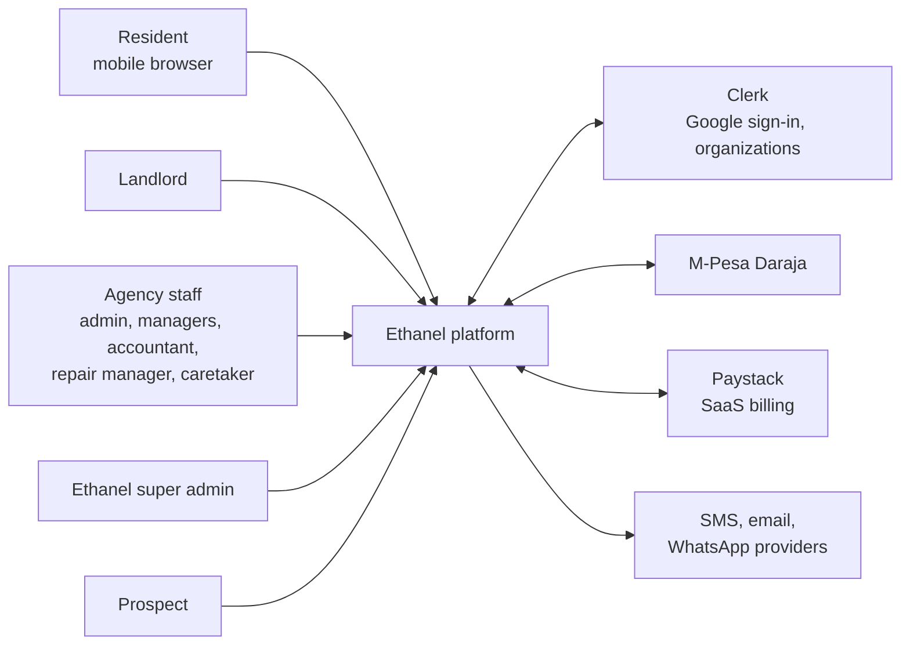
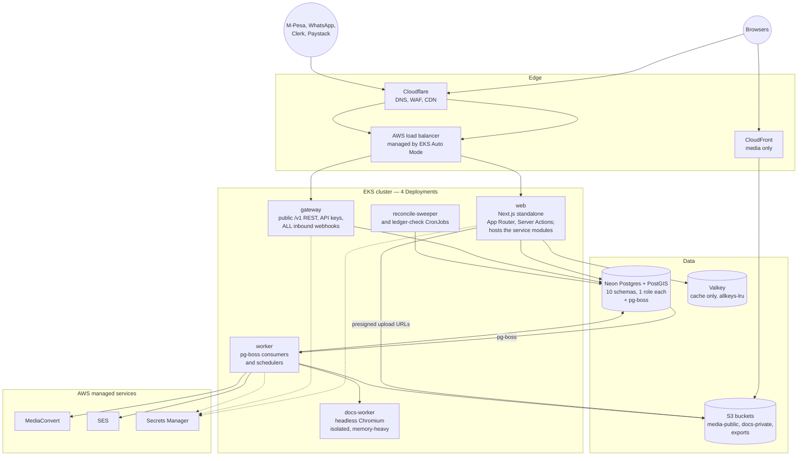
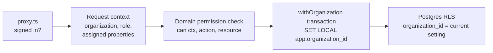
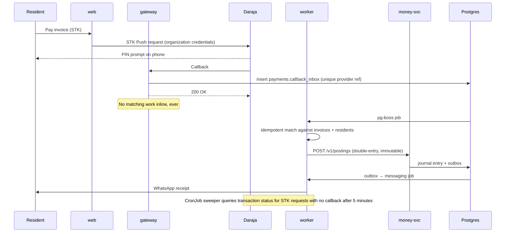
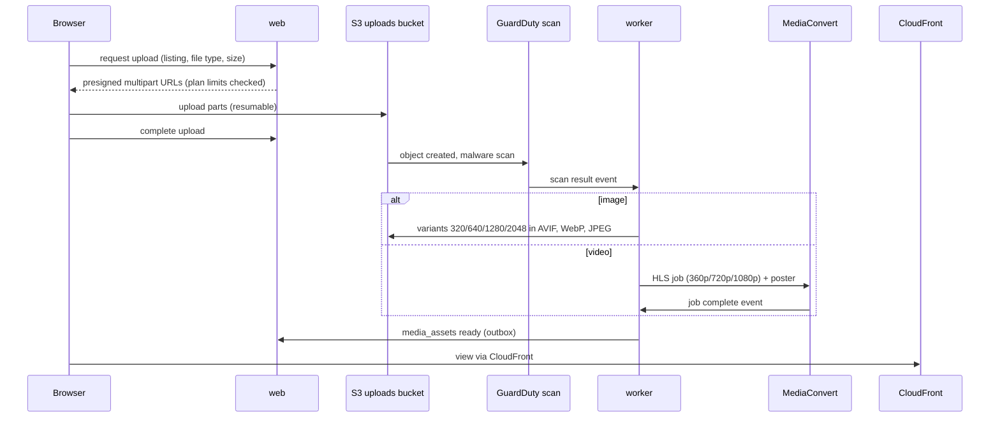
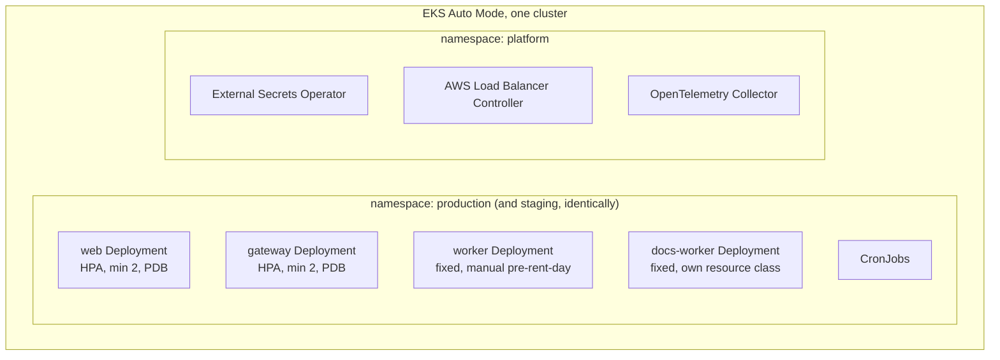
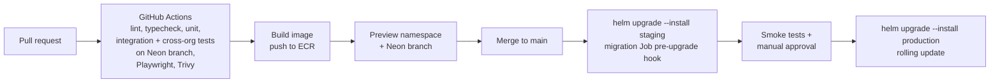

# Ethanel — Architecture v1.2

| | |
|---|---|
| **Date** | 15 September 2026 |
| **Author** | Njuguna Njenga (Cpt. N) |
| **Companion** | Ethanel PRD v1.2 · `DECISIONS.md` · `SERVICE-TOPOLOGY.md` |
| **Change log** | **1.2:** reconciled with the round 2 decisions in `DECISIONS.md`. Eleven logical services deployed as four Deployments (ADR-001), Prisma 7 (ADR-004), `pg-boss` on Postgres (ADR-005), one Valkey for cache only, schema per service (ADR-008), all inbound webhooks at `gateway` (ADR-011), OpenTofu, GitHub Actions + Helm, AWS only, sixteen one-week sprints, ADR numbering aligned to `DECISIONS.md`. Closes `RECONCILIATION.md` |
| | **1.1:** organization/resident/landlord naming, verified WhatsApp numbers, outside view at near-zero cost, 360° photos, video viewings, WhatsApp channel, e-signature, AI, eTIMS, land projects, minimum pilot platform (§11.0) |
| **Scope** | Release 1 platform: web app, gateway, background workers, data, integrations, Kubernetes deployment. **Public marketing site in scope from D-68**, governed by `.docs/tracks/marketing-site/` — this row read "Landing page out of scope" until that decision reversed it |

---

## 1. Architecture principles

1. **Twelve logical services, four Deployments.** The domain is divided into twelve services (`SERVICE-TOPOLOGY.md`): `web`, `gateway`, and ten domain services, each of which owns exactly one Postgres schema, one database role and one versioned contract in `packages/contracts`. ADR-001 fixed eleven; **D-67 added `reporting-svc` as the twelfth**, and the Deployment count did not move. Those twelve are *hosted* in four Kubernetes Deployments — `web`, `gateway`, `worker`, `docs-worker` — until a service's scaling profile, blast radius or deploy coupling earns it a pod of its own. The boundary is the architecture; the pod count is a deployment detail, and moving one costs a `values.yaml` because nothing joins across a schema line. Split triggers in §13; the reasoning in ADR-001.
2. **Money is correct before it is fast.** Rent, expenses and landlord balances run on an append-only double-entry ledger. Every payment integration is idempotent.
3. **Isolation in two layers.** Every query is scoped to a organization in the data access layer, and Postgres row-level security blocks anything the application misses.
4. **Asynchronous by default for side effects.** Notifications, reconciliation, report exports, media processing and billing run as queued jobs with retries.
5. **Stateless pods, and nothing durable in the cache.** No local disk state; files in object storage; shared cache in Valkey. Losing the whole Valkey cluster must cost latency, never data — which is why background work is `pg-boss` on Postgres and not a Redis queue (ADR-005).
6. **Kubernetes-portable, cloud-pragmatic.** Workloads are plain Kubernetes; managed cloud services are used where operating them ourselves adds risk.
7. **Everything as code.** OpenTofu for cloud, Helm for workloads, GitHub Actions for delivery, Prisma migrations for schema, reviewed SQL for RLS policies, views and functions.

## 2. System context



## 3. Cloud decision: AWS (GCP rejected)

The founder allowed AWS or GCP. **AWS is decided** (D-28, D-29); the GCP column below is retained only as the record of what was rejected and why. The deciding factor was the database.

- **Neon now runs only on AWS.** Its Azure regions were deprecated in April 2026 and it has no GCP regions. Running the cluster on GCP would put every database round trip across clouds and the public internet, adding latency to every request and egress cost to every query.
- A GCP deployment would remain viable only by swapping Neon for Cloud SQL or AlloyDB for PostgreSQL, losing Neon branching for preview environments. Not pursued.

| Concern | AWS (chosen) | GCP (rejected) |
|---|---|---|
| Kubernetes | Amazon EKS in **Auto Mode** (AWS manages nodes, scaling, load balancer and storage) | GKE Autopilot |
| PostgreSQL | **Neon** in the same AWS region | Cloud SQL or AlloyDB (no Neon) |
| Cache (only — queues are `pg-boss` on Postgres) | Amazon ElastiCache for **Valkey**, one cluster | Memorystore for Valkey |
| Edge | **Cloudflare** for DNS, WAF and CDN in front of the load balancer | Cloudflare equally |
| Object storage and CDN | S3 + CloudFront | Cloud Storage + Cloud CDN |
| Video transcoding | AWS Elemental MediaConvert | Transcoder API |
| Secrets | Secrets Manager + External Secrets Operator | Secret Manager + External Secrets Operator |
| Email | Amazon SES | Third-party provider |
| Malware scanning of uploads | GuardDuty Malware Protection for S3 | ClamAV job or third-party |
| Container registry | ECR | Artifact Registry |
| WAF | Cloudflare WAF at the edge, AWS WAF managed rules on the load balancer | Cloud Armor |

**Region (D-38, becomes ADR-002).** Place EKS, ElastiCache and S3 in the same AWS region as the Neon project. The region is **open until Sprint 001 measures it**: p50 and p95 round-trip from Nairobi on a real Safaricom mobile network — not from a datacentre — across `af-south-1` (Cape Town), `eu-west-1` (Ireland) and `eu-central-1` (Frankfurt). E14's answer ("region africa, scale international later") biases toward `af-south-1`; the measurement decides. Measure before creating the production project, because a Neon project's region cannot be changed later. CloudFront serves media from edge locations close to users. Fallback if no candidate gives acceptable p95 on Neon: RDS in `af-south-1`, which costs the branching workflow — see RISKS R-06.

## 4. Container view



| Deployable | Hosts | Responsibility | Scaling |
|---|---|---|---|
| `web` | `web` + the ten domain service modules, in-process behind their contracts | All UI (resident, landlord, staff, caretaker, super admin), Server Actions, exports download | HPA on CPU and requests per pod; min 2, PodDisruptionBudget |
| `gateway` | `gateway` + the inbox writers of the services it feeds | Public versioned REST API, API keys and scopes, per-key rate limits, and **every inbound webhook**: verify signature, persist to the owning service's inbox table, return 200 | HPA; min 2, PodDisruptionBudget |
| `worker` | `money-worker`, `payments-worker`, `messaging-worker` handlers | `pg-boss` consumers and schedulers: rent runs, statements, arrears rollups, callback draining and matching, outbound WhatsApp and SMS, media processing, metering, exports | Fixed replicas, scaled up manually before rent days (D-35); queue-class concurrency within the Deployment |
| `docs-worker` | `docs-worker` | Headless Chromium (Playwright) rendering of leases, receipts, invoices and statements. Isolated so a Chromium leak cannot take a request path down (D-10) | Fixed, own resource class |
| CronJobs | — | Nightly metering snapshot, ledger integrity check, STK reconciliation sweeper, data retention | Kubernetes CronJob |

**One artifact, four entrypoints.** All four Deployments build from the same monorepo and inherit the same `charts/service` Helm library chart. A domain service is a package under `packages/services/`, not a pipeline: it declares its schema, its role, its contract and its job handlers, and the entrypoint that loads it is configuration. Each module opens its own Prisma client bound to its own schema and role, so **the schema boundary is enforced by Postgres even while the code shares a pod** — an in-process caller still cannot read another service's tables. That is what makes the later split (§13) a deployment change rather than a rewrite.

**Why webhooks live in `gateway`, not `web` (D-14, ADR-011).** Payment callbacks must be acknowledged fast and must never be lost. Putting them on the UI Deployment couples callback availability to page-render load, and a `web` rollout or an HPA scale-down becomes a dropped Daraja retry. `gateway` verifies the signature, writes the raw payload to the owning service's inbox table and returns 200 within milliseconds; matching is always asynchronous in `worker`. Nothing about a callback is processed inline. This is what lets the D-41 bar — 50 callbacks/second for 10 minutes with zero loss — survive a slow reconciliation query or a restart: work is delayed, never dropped.

## 5. Application architecture

### 5.1 Monorepo layout

```
ethanel/
├─ apps/                      # one per Deployment — entrypoints only, no domain logic
│  ├─ web/                    # Next.js App Router (Active LTS line, D-16)
│  │  ├─ app/
│  │  │  ├─ (marketing)/      # public marketing site, no auth (D-68)
│  │  │  ├─ (auth)/           # Clerk sign-in / sign-up
│  │  │  ├─ (resident)/r/…    # resident PWA
│  │  │  ├─ (landlord)/l/…    # landlord portal
│  │  │  ├─ (org)/w/[orgSlug]/…   # staff app
│  │  │  ├─ (caretaker)/c/…   # PWA task screens
│  │  │  └─ (admin)/admin/…   # super admin
│  │  ├─ content/marketing/   # typed marketing copy modules (D-68)
│  │  └─ proxy.ts             # clerkMiddleware route protection
│  ├─ gateway/                # public /v1 REST, API keys, ALL inbound webhooks
│  ├─ worker/                 # pg-boss consumers and schedulers
│  └─ docs-worker/            # headless Chromium (Playwright) rendering
├─ packages/
│  ├─ chassis/                # config, structured logging, OpenTelemetry, probes,
│  │                          # graceful shutdown, error envelope, internal JWT,
│  │                          # pg-boss wiring, Prisma base client + RLS hook
│  ├─ contracts/              # zod schemas → OpenAPI → React Hook Form validation;
│  │                          # one definition per request shape (D-02)
│  ├─ services/               # the ten domain services, one folder each. Each
│  │  │                       # declares its schema, role, contract, job handlers
│  │  ├─ identity/            # organizations, users, memberships, roles, audit
│  │  ├─ property/            # landlords, properties, units, leases, residents
│  │  ├─ listing/             # listings, plots, storefronts, viewings, search
│  │  ├─ money/               # chart of accounts, journal, invoices, statements
│  │  ├─ payments/            # Daraja, intents, reconciliation, suspense
│  │  ├─ messaging/           # WhatsApp, inbox, preferences, templates
│  │  ├─ ops/                 # repair requests, work orders, inspections,
│  │  │                       # meter readings, running costs, vendors
│  │  ├─ docs/                # template catalogue, render requests
│  │  ├─ billing/             # SaaS plans, usage counters, feature flags
│  │  └─ reporting/           # rpt_* read models, fed only by outbox
│  │                         # events (D-67, ADR-012)
│  ├─ db/                     # Prisma schema per service, migrations, RLS SQL, seed
│  ├─ auth/                   # Clerk helpers, permission checks, organization context
│  ├─ integrations/           # mpesa, paystack, sms, email, whatsapp, media, ai
│  ├─ ui/                     # design system (Tailwind v4 + shadcn/ui), data grid
│  └─ config/                 # eslint, tsconfig, env schema (zod)
├─ infra/tofu/                # OpenTofu: VPC, EKS Auto Mode, ElastiCache Valkey,
│                             # S3, CloudFront, IAM, SES, Secrets Manager, Cloudflare
├─ charts/service/            # Helm library chart every Deployment inherits (D-34)
├─ deploy/helm/               # values per Deployment per environment
├─ .docs/                     # the operating pack: PRD, ARCHITECTURE, DECISIONS,
│                             # SERVICE-TOPOLOGY, ROADMAP, RISKS, QUESTIONS,
│                             # STATE, adr/, sprints/
└─ .claude/                   # agents, commands (repo kit)
```

### 5.2 Service boundaries, and the v1.1 module map

**Ten** domain services, each owning one schema and one role — the nine built for the pilot plus `reporting-svc` (D-67, ADR-012). The right-hand column maps the fifteen v1.1 modules onto them, so nothing from v1.1 is left without an owner.

| Service | Schema | Owns | Publishes events | v1.1 modules absorbed |
|---|---|---|---|---|
| `identity-svc` | `identity` | Organizations (Clerk org mirror), users, memberships, roles, permissions, property assignments, support sessions, audit log, Clerk webhook projection | `organization.created`, `membership.changed` | `platform` |
| `property-svc` | `property` | Landlords, management agreements, properties, units, unit types, amenities, leases, residents, lease lifecycle, deposits held, inspections, caretaker assignment, occupancy | `unit.status_changed`, `lease.activated`, `lease.ended` | `portfolio`, `leasing` |
| `listing-svc` | `listing` | Marketplace listings (unit / house / plot, sale or lease), media, storefronts, viewings, leads, calendar links, plot inventory and subdivisions, sale transactions and milestones, search (Postgres FTS + `pg_trgm`) | `listing.published`, `lead.qualified`, `viewing.confirmed`, `plot.reserved`, `milestone.completed` | `marketplace`, `land` |
| `money-svc` | `money` | Chart of accounts, double-entry journal, balances, invoices and charge types, rent schedules, credit notes, receipts, reminders, penalties, reversals, period close, arrears, landlord periods, statements, remittance records, management fee, eTIMS invoice records (1.1). **The only writer of ledger truth.** | `invoice.issued`, `journal.posted`, `statement.issued`, `etims.issued` | `ledger`, `landlord-accounting`, `tax` (1.1), and the invoicing half of `billing` |
| `payments-svc` | `payments` | M-Pesa Daraja (paybill/C2B, STK push), payment intents, callback inbox, client-account mapping, idempotency keys, reconciliation engine, allocations, suspense account, manual match queue | `payment.received`, `payment.matched`, `payment.unmatched` | the collections half of `billing` |
| `messaging-svc` | `messaging` | WhatsApp conversations and inbox assignment, template catalogue and approval state, notification preferences, verification codes, SMS and email fallback, delivery status | `message.received`, `notification.delivered` | `messaging` |
| `ops-svc` | `ops` | Repair requests, work orders, SLAs, caretaker tasks, inspections evidence, meter readings, expenses, recurring running costs, approvals, vendors | `repair.status_changed`, `expense.approved`, `reading.captured` | `maintenance`, `costs` |
| `docs-svc` | `docs` | Template catalogue, render requests, document store metadata, signature requests and certificates, document hashes | `document.rendered`, `document.signed` | `signatures` |
| `billing-svc` | `billing` | SaaS plans, entitlements, usage counters, subscription invoices, per-organization feature flags | `entitlements.changed` | `saas-billing` |
| `reporting-svc` | `reporting` | **Read models, exports and saved views.** Materialised `rpt_*` tables fed **only** by outbox events from the services above, with a replay path — never by a cross-schema join (D-11). Settled by **D-67 / ADR-012**; the schema is created in Sprint 002 with the other nine. Hosted in `web` for reads and `worker` for projections, so the four-Deployment shape of D-54 is unchanged. | `export.ready` | `reporting` |

Rules:

- A service reads another service's data **only** through that service's contract in `packages/contracts` — in-process today, over versioned `/v1` REST once it is split out. The call site does not change when it splits.
- **No cross-schema joins and no cross-schema foreign keys, anywhere** (D-11, ADR-008). This applies to reporting too; it is why `reporting` is unowned rather than quietly reaching across boundaries as it did in v1.1.
- Each service's Prisma client connects as that service's own role, which can see only that service's schema. A module that tries to read across a boundary fails at the database, not at review.
- Events go through the transactional outbox (§8.3), never a direct write into another schema.
- `money` is append-only for postings. Corrections are new entries with a reason (D-44).

### 5.3 Request path in `web`

1. `proxy.ts` (Clerk middleware) rejects unauthenticated access to protected route groups. It is a coarse gate only.
2. Server Component or Server Action calls `getRequestContext()`: Clerk `auth()` → user ID, active organization ID and permissions → Ethanel organization ID, role, assigned property IDs (cached in Valkey for 60 s, invalidated on assignment changes).
3. The Server Action calls a **service contract**, never a table. `identity-svc` checks permission (for example `can(ctx, 'expense.approve', property)`); the owning service does the work.
4. Inside that service, data access runs through its own Prisma client inside `withOrganization(ctx, tx => …)`, which opens a transaction and sets `SET LOCAL app.organization_id` and `app.user_id` so RLS policies apply.
5. Writes append audit entries and outbox events in the same transaction.
6. Anything slower than the request — a receipt, a notification, a PDF, a rollup — is an outbox event drained by `worker`, not work done on the request path.

### 5.4 Caching strategy

| Layer | What | Where | Invalidation |
|---|---|---|---|
| Cache Components / `use cache` | Marketplace, storefronts and reference data only — plan catalogue, report definitions, listing pages (D-18) | Shared Valkey via `cacheHandlers` | `revalidateTag` / `updateTag` on writes |
| Request context | User → organization, role, assigned properties | Valkey, 60 s TTL | Explicit delete on membership or assignment change |
| Rate limits, one-time codes, idempotency | Webhook dedupe keys, per-key API rate limits, OTP codes, export requests | Valkey | TTL |
| **Never cached** | Landlord portal figures, dashboard KPIs, balances on payment screens, invoices, receipts, statements | Always read live from the ledger, with a "last updated" stamp | — |

**Landlord and dashboard figures are not cached (D-45, conflict resolved against v1.1).** v1.1 cached KPI tiles in Redis for 5 minutes. That is now forbidden: every landlord-facing and dashboard figure reads live from the ledger and carries a visible "last updated" timestamp. A landlord seeing a stale arrears number costs trust and, at month-end, money; a 5-minute TTL on a figure someone acts on is not a cache, it is a wrong answer with a shelf life. Report *read models* are a different thing and are governed by §7.4.

Several `web` pods need a **shared cache handler**: by default each pod keeps its own cache, so one pod can serve stale data after another has revalidated. Configure `cacheHandlers` with a Valkey-backed handler and turn off the in-memory cache. Choose a maintained handler that explicitly supports the plural `cacheHandlers` API and `use cache`, and load-test tag invalidation across pods before production.

**One Valkey cluster, cache only (D-04, D-05).** v1.1 ran two Redis clusters because BullMQ queues must never be evicted (`noeviction`) while cache keys must be (`allkeys-lru`). With `pg-boss` on Postgres there is no queue in the cache, so the split is unnecessary: one `allkeys-lru` Valkey cluster holds cache, rate-limit counters, OTP codes and short-lived session data, and **nothing durable lives in it**. Losing the entire cluster must cost latency and nothing else — that property is what makes the `pg-boss` choice load-bearing rather than a preference, and it is verified by a chaos step in Sprint 014.

## 6. Authentication and authorisation (Clerk)

### 6.1 Identity model

| Concept | Clerk | Ethanel database |
|---|---|---|
| Person | User (Google sign-in only, including Ethanel staff) | `users` mirror (clerk_user_id, name, email) |
| Verified WhatsApp number | Not stored in Clerk | `verified_phones` (user_id, e164, verified_at, method, opt_in_at); required before linking payments, chats, leases or leads |
| Organization (agency, land company, Ethanel's own portfolio) | Organization | `organizations` (clerk_org_id, plan, status, billing) |
| Staff role | Organization membership role + permissions | `memberships` mirror + `property_assignments` |
| Landlord access | *Not* an org member | `landlord_contacts` (user ↔ landlord record) |
| Resident access | *Not* an org member | `lease_parties` (user ↔ lease) |
| Super admin | User with private metadata flag set only via backend | `platform_admins` |

Clerk configuration:

- Organizations enabled with **membership optional**, because landlords, residents and prospects use Ethanel without belonging to an organization.
- Organization roles: `org:owner`, `org:admin`, `org:property_manager`, `org:agent`, `org:accountant`, `org:repair_manager`, `org:caretaker`. Permissions such as `org:billing:manage`, `org:expense:approve`, `org:report:export`.
- Custom session token claims: active org ID, role and permissions, so most checks need no extra call.
- Webhooks (`user.*`, `organization.*`, `organizationMembership.*`) verified and processed idempotently into the mirror tables.
- Property-level scoping is Ethanel's responsibility (Clerk has no concept of properties).
- Support impersonation, if enabled, runs only inside a PRD M1-08 support session and is audited.
- **Profile completion gate:** after first Google sign-in, users without a verified WhatsApp number are routed to `/onboarding/phone`. The code is sent with a WhatsApp authentication template (SMS fallback), stored hashed in Valkey for 5 minutes, limited to 5 attempts per hour per user and per number.
- **Linking rules:** an M-Pesa payer number, WhatsApp conversation or lease party is linked to a user only when it matches that user's verified number. Staff can link manually with an audit entry.
- **Staff Google Calendar:** staff who connect a calendar re-authorise the Clerk Google connection with the `calendar.events` scope; the backend reads the OAuth token through Clerk when creating viewing events.

Cost note: Clerk bills monthly retained users and retained organizations. Residents who only pay by paybill never sign in and never count. Confirm current plan and add-on prices (organizations features, impersonation) on Clerk's pricing page when choosing the production plan.

### 6.2 Authorisation layers



- **RLS with a connection pooler:** Neon's pooled connections run in transaction mode, so session variables must be set with `SET LOCAL` inside each transaction, never with plain `SET`.
- The application connects as a role **without** `BYPASSRLS`. Migrations and super admin maintenance jobs use separate roles.
- Landlord and resident portals query through dedicated policies (`landlord_id IN current landlord IDs`, `lease_id IN current lease IDs`) so they can span organizations safely.

## 7. Data architecture

### 7.1 Database

- **Neon Postgres** with PostGIS (listing locations, plots). **One Neon project, one schema per service, one role per schema** (D-11, ADR-008). Ten domain schemas — the nine service schemas plus `reporting` (D-67) — plus the `pgboss` schema.
- **Prisma 7** for schema and migrations (D-03, ADR-004 — supersedes the v1.1 Drizzle choice); one Prisma schema per service, each generating a client bound to that service's role. SQL files for RLS policies, views and functions, reviewed like code.
- **Why one project rather than nine databases:** it keeps the boundary discipline of separate databases — nothing joins across the line — while keeping one `pg-boss` installation, one full-text index, one PITR timeline and one backup drill. Splitting a schema onto its own Neon project later is a connection-string change.
- **Branching:** each pull request gets a Neon branch for its preview environment and migration test.
- **Read path for reports:** the primary, with a Neon read replica for heavy exports when p95 report latency exceeds the PRD target. No cached aggregate layer (§5.4); the read-model design is §7.4.
- **Search:** Postgres full-text search and `pg_trgm` for resident, unit and listing search (D-06). Neon deprecated the `pg_search` extension for new projects in March 2026, so do not plan on it. **No separate search engine is planned.** If Release 2 public search needs relevance tuning beyond Postgres, OpenSearch or Typesense is a deferred option to evaluate then — not a step on this roadmap.

### 7.2 Core schema (abridged)

These tables are distributed across the ten schemas of §5.2 — `organizations`, `memberships`, `property_assignments`, `platform_admins`, `verified_phones` and `audit_log` in `identity`; `landlords` through `lease_parties` in `property`; `invoices`, `charge_types`, `receipts`, `ledger_*`, `journal_*`, `landlord_*`, `remittances`, `etims_invoices` in `money`; `payments`, `payment_allocations`, `webhook_events` in `payments`; and so on. **Every foreign key shown below that would cross a schema line becomes an id reference validated through the owning service's contract, not a database constraint** (D-11). `outbox_events` and a callback/inbox table exist per schema rather than once globally.

Two columns are load-bearing and easy to miss:

- **`units.code` is the M-Pesa account reference.** It is what a resident types when paying by paybill, and it is unique per property. Together with `payments.provider_ref` being unique, this is the mechanism behind the reconciliation order in §9.1 — and it is most of the answer to QUESTIONS Q3.
- **`payments.provider_ref` unique** is what makes a repeated Daraja callback a no-op rather than a double receipt.

| Table | Key columns | Notes |
|---|---|---|
| `organizations` | id, clerk_org_id, name, plan_id, status, billing_day | RLS root |
| `memberships` | organization_id, user_id, role | Mirror of Clerk |
| `property_assignments` | organization_id, property_id, user_id, role_on_property | Caretaker, repair manager, manager |
| `landlords` | id, organization_id, type, kra_pin_enc, payout_method, repair_approval_threshold | |
| `management_agreements` | landlord_id, property_id?, fee_type, fee_rate, fee_base, remittance_day | Versioned by effective date |
| `properties` | id, organization_id, landlord_id, name, type, county, location `geography(Point)` | |
| `units` | id, property_id, code, type, rent_default, status | `(property_id, code)` unique; code is M-Pesa reference |
| `residents` | id, organization_id, name, phone, email, id_number_enc | |
| `leases` | id, unit_id, start_date, end_date, rent, billing_day, deposit, penalty_rule, status | |
| `lease_parties` | lease_id, resident_id, user_id? | Links logins |
| `invoices` / `invoice_lines` | lease_id, period, due_date, status; line type, amount | |
| `meter_readings` | unit_id, meter_type, reading, read_at, captured_by, photo_key | |
| `payments` | id, organization_id, channel, provider_ref (unique), msisdn, amount, received_at, raw_event_id, status | Unique provider reference prevents duplicates |
| `payment_allocations` | payment_id, invoice_id, amount | |
| `receipts` | payment_id, number (per-organization sequence) | |
| `ledger_accounts` | id, organization_id, type, landlord_id?, property_id?, lease_id? | **The chart of accounts is pinned in `DOMAIN.md` §4 and this row defers to it** (D-61). Nine accounts. Note the key: the receivable is `lease_id`, and is called **lease receivable**, not "resident receivable" (D-57, ADR-023) |
| `journal_entries` / `journal_lines` | entry: source_type, source_id, posted_at; line: account_id, debit, credit | Constraint: sum(debit) = sum(credit) per entry; append-only |
| `expenses` | property_id, category, vendor_id?, amount, paid_from, charge_to, status, work_order_id? | |
| `recurring_costs` | property_id, category, amount, schedule | |
| `approvals` | subject_type, subject_id, level, approver_user_id, decision, decided_at | |
| `landlord_periods` / `landlord_statements` / `remittances` | landlord_id, period, locked_at; totals, file_key; amount, method, reference | |
| `repair_requests` | id, property_id, unit_id, reporter_user_id, category, urgency, status, sla_due_at | |
| `work_orders` | request_id, assignee_type, assignee_id, est_cost, actual_cost, status | |
| `listings` / `media_assets` | unit_id or plot data, status; asset: kind, s3_key, variants JSON, hls_manifest_key, scan_status | |
| `viewings` | listing_id, prospect contact, slot, assignee, status | |
| `plans` / `entitlements` / `usage_snapshots` / `subscriptions` / `saas_invoices` | features JSON, limits; per-day counts; Paystack refs | |
| `verified_phones` | user_id, e164 (unique per verified user), verified_at, whatsapp_opt_in_at | Identity link for payments, chats, leads |
| `charge_types` | organization_id, name, kind (fixed, metered, percentage, one_off), rate, ledger_account | Organization-defined charges |
| `signature_requests` / `signatures` | document_id, signers, status; signer_user_id, otp_verified_at, ip, user_agent, doc_sha256 | Simple e-signature audit trail |
| `wa_conversations` / `wa_messages` | organization_id, contact_phone, linked resident/landlord/lead, assignee, window_expires_at; direction, template, status, meta_id | WhatsApp inbox |
| `leads` / `lead_events` | listing_id, prospect_user_id, source, stage, assignee, qualified_at, disputed_at; event type, note | Pipeline and lead billing |
| `calendar_links` | viewing_id, provider, external_event_id, meet_url | Google Calendar sync |
| `land_projects` | organization_id, name, county, parent_parcel_ref, area, plan_media_id, plan_georef JSON | Sprint 012, or R1.1 if 012 slips |
| `plots` | land_project_id?, organization_id, label, size, price, status, boundary `geometry(Polygon, 4326)`, boundary_source (surveyed, illustrative), beacons `geometry(MultiPoint, 4326)` | Sprint 012, or R1.1 if 012 slips. **No `code` column** — a plot has no M-Pesa account reference, which is Q19 |
| `sale_transactions` / `sale_milestones` | plot_id or unit_id, buyer_user_id, status; type, due_date, completed_at, documents, responsible | Sprint 012, or R1.1 if 012 slips |
| `doc_extractions` | document_id, model, fields JSON, confidence, confirmed_by, confirmed_at | Release 1.1 |
| `etims_invoices` | organization_id, source_invoice_id, integrator_ref, cu_invoice_number, qr_payload, status | Release 1.1 |
| `map_sessions` | month, provider, count | Hard cap for metered 3D sessions |
| `outbox_events` | id, aggregate, type, payload, created_at, published_at | Transactional outbox |
| `webhook_events` | provider, event_id (unique), payload, received_at, processed_at, error | Raw store for replay |
| `audit_log` | organization_id, actor_user_id, action, entity, before, after, ip, at | Append-only |

**Primary keys are UUIDv7, generated in the application** (D-07, ADR-006) — time-ordered, so they index well without leaking a sequence. Money is `bigint` minor units (KES cents) end to end; no float and no decimal string goes near a money path (D-08, ADR-007). All timestamps `timestamptz`; business dates as `date` in Africa/Nairobi.

### 7.3 Ledger postings (examples)

| Event | Debit | Credit |
|---|---|---|
| Invoice issued (rent 25,000) | Lease receivable 25,000 | Landlord rental income 25,000 |
| M-Pesa payment allocated (25,000) | Cash in transit (collection account) 25,000 | Lease receivable 25,000 |
| Repair expense charged to landlord (3,000) | Landlord expense: repairs 3,000 | Expense payable / paid-from account 3,000 |
| Management fee at close (10% of 25,000) | Landlord management fee 2,500 | Agency fee income 2,500 |
| Remittance to landlord (19,500) | Landlord payable 19,500 | Cash-in-transit 19,500 |

Landlord statements, arrears, collections and income reports are all queries over journal lines, which is what makes every Excel export reconcile.

### 7.4 Reporting read models — **settled: ADR-012, a read-model service**

**This was the one structural hole the reconciliation opened. It is now filled** — D-67 / `.docs/adr/ADR-012-reporting-read-model.md`. The option chosen is the **read-model service**: a tenth logical service owning a `reporting` schema, fed only by outbox events, materialising `rpt_*` tables with a replay path. It is created in **Sprint 002** with the other nine, not at the end of Sprint 004, because under D-54 a tenth service costs a package, a schema and a role — no pod, no PodDisruptionBudget, no rollout step. The three candidates and why the other two lost are recorded in the ADR; the table below is kept as the record of what was weighed.

v1.1 fed reports from materialised summary tables (`rpt_collections_daily`, `rpt_arrears_snapshot`, `rpt_occupancy_daily`, `rpt_expenses_monthly`, `rpt_repairs_daily`) built by cross-module joins in a `reporting` module. D-11 forbids cross-schema joins, and the rent roll, arrears ageing and landlord statement each span four or five services. **The v1.1 design is therefore suspended, not adopted**, and `reporting` has no owner in §5.2.

The three candidates that were weighed — **the first was chosen** (D-67). Sprint 005's ledger design depended on this, which is why it was dated to Sprint 004 and then pulled forward:

| Option | Shape | Cost |
|---|---|---|
| **Read-model service** | A tenth service owning a `reporting` schema, fed only by outbox events from the others. Materialised `rpt_*` tables rebuilt from the event stream. | Eventual consistency on every report; a replay path to build and to test; one more service. |
| **Composition in `web`** | Each service exposes its own report endpoints; `web` joins the pages in memory for the grid. | No new schema, no staleness. Pagination, sorting and totals across services get hard fast — and the grid needs server-side sort over the whole set (§7.4 below). |
| **Reporting schema with subscriptions** | A `reporting` schema with read-only Postgres subscriptions or views onto the others. | Cheapest to write; weakest boundary — it re-creates the coupling D-11 exists to prevent, and it makes a later Neon-project split painful. |

Whichever is chosen, two rules already hold: **reports are fed by outbox events, never by a cross-schema join**, and **every figure reconciles to the ledger** (PRD M7-05). Until ADR-012 lands, Sprint 004 builds the grid against `property`- and `money`-owned endpoints only, which is enough for the rent roll and does not prejudge the answer.

- Grids request pages of rows from Server Actions with server-side sort, filter and grouping for datasets over 5,000 rows; smaller sets load fully for instant client-side interaction.
- **Grid component:** an Excel-like React data grid with virtualisation. AG Grid Community covers sorting, filtering, virtual scrolling and CSV export; row grouping, pivoting and styled Excel export need AG Grid Enterprise (commercial licence). Release 1 uses Community plus server-generated XLSX (ExcelJS in `worker`); the licence decision is D-20, which puts Enterprise behind a usability-test trigger. Earlier drafts cited "PRD O6"; the PRD has no O-series code and never did.
- **Exports:** request → job → XLSX/PDF written to `exports` bucket → notification with a signed link valid for 24 hours.

## 8. Asynchronous processing

### 8.1 Queues (`pg-boss` on Neon Postgres)

All background work is `pg-boss` in the `pgboss` schema of the same Neon project (D-04, ADR-005). The v1.1 design used BullMQ on a dedicated `noeviction` Redis cluster; that is void. The reason for the change is durability, not cost: a job that lives in the same transactional store as the data it acts on cannot be lost by a cache eviction, a failover or an `allkeys-lru` policy mistake, and it can be enqueued in the *same transaction* as the write that justifies it (§8.3).

| Queue | Jobs | Concurrency and retry |
|---|---|---|
| `money-critical` | payment-reconcile, receipt-issue, ledger-post, reversal-apply | Low concurrency, per-organization singleton keys, exponential backoff, dead-letter after 10 attempts with alert |
| `default` | notification-send, repair-sla-check, approval-request, statement-generate | Medium concurrency |
| `bulk` | report-export, invoice-run, bulk-notice, import-excel | Higher concurrency, rate-limited per organization |
| `media` | image-variants, video-transcode-start, video-transcode-complete, scan-result | Memory-heavy; own concurrency budget inside `worker` |
| `docs` | lease-render, invoice-render, receipt-render, statement-render | Drained by `docs-worker` only — Chromium is isolated from every other job class (D-10) |
| `saas` | usage-snapshot, subscription-invoice, dunning-step, entitlements-sync | Scheduled |
| `messaging` | whatsapp-inbound-route, verification-code-send, template-send, sms-fallback | Rate-limited to provider limits; 24-hour-window aware |
| `tax` (1.1) | etims-issue, etims-credit-note | Low concurrency, idempotent retries |

**Every job is idempotent and resumable, keyed on the event id.** A rent run must be safe to execute twice and safe to resume after a crash mid-batch (D-40). This is a merge gate on `money-svc` and `payments-svc`, not a convention.

Queue classes are concurrency budgets inside the one `worker` Deployment, not separate Deployments. When one class needs its own scaling profile or its own blast radius, it becomes its own Deployment under the §13 split trigger — `docs-worker` is already split out for exactly that reason.

### 8.2 Scheduling

`pg-boss` scheduled jobs (cron expressions, per-organization singleton keys) for per-organization schedules — billing-day invoice runs, reminders, SLA checks — because they need organization time settings and must not double-fire when `worker` has several replicas. Kubernetes CronJobs for platform-wide sweeps (metering snapshot, ledger integrity check, STK status sweeper, retention).

### 8.3 Transactional outbox

There are no distributed transactions (D-13, ADR-010). The pattern is:

1. A service writes its own rows **and** an `outbox_events` row in one transaction in its own schema.
2. A relay in `worker` publishes pending outbox rows as `pg-boss` jobs and marks them published.
3. The consumer handles the job idempotently, keyed on the event id.

This guarantees that a committed payment always produces its receipt and notification, and that a rolled-back write never does. Because `pg-boss` lives in the same Postgres instance, steps 1 and 2 can share a connection — but they deliberately stay separate steps, so that a consumer being down never blocks a business write.

## 9. Integrations

### 9.1 M-Pesa rent collection



- **All inbound webhooks terminate at `gateway`** (D-14, ADR-011) — M-Pesa, WhatsApp, Clerk and Paystack alike. `gateway` verifies the signature, writes the raw payload to the owning service's inbox table and returns 200. It never matches, posts or notifies inline.
- **Credentials** (shortcode, passkey, consumer key and secret) are stored per organization or per landlord, encrypted with an AWS KMS data key; plaintext only in process memory during the call.
- **Paybill payments** use C2B confirmation URLs registered per shortcode; account reference is `units.code`.
- **Idempotency:** unique constraint on the provider transaction reference; the callback endpoint is safe to receive the same event any number of times.
- **Reconciliation order** (the algorithm behind the D-39 95% bar): account reference → payer phone on file (`verified_phones`) → exact amount match on open invoices → review queue. **Oldest invoice first; overpayment becomes a credit.**
- **Unmatched payments post to a suspense account immediately** (D-15) and sit in a manual match queue. They are money in the ledger from the moment they arrive — just not yet attributed. That is what makes the 95% bar a measurement rather than a cliff, and it is why Ethanel never holds money outside the ledger.
- **Burst capacity:** the inbox design is load-tested to 50 callbacks/second for 10 minutes with zero loss (D-41), in Sprint 007. A slow reconciliation query, a Daraja retry storm or a `money-svc` restart delays work; it never drops it.
- **Callback security:** validate payload structure and shortcode ownership, restrict the callback path at the WAF to Safaricom's published source addresses, and confirm uncertain payments with a transaction status query.

### 9.2 SaaS billing (Paystack)

Card subscriptions use Paystack stored authorisations for recurring charges; M-Pesa subscribers get a prompt or paybill instructions per cycle. Webhooks arrive at `gateway` and follow the same verify → persist → 200 → `pg-boss` pattern as every other provider. `entitlements-sync` mirrors plan features to Clerk organization public metadata and Valkey. Pilot invoicing is manual (DEBT-01); `billing-svc` records usage counters from Sprint 012 so the automation has history to work from.

### 9.3 Media pipeline (photos and videos)



- Buckets: `media-uploads` (private, quarantine), `media-public` (CloudFront origin with origin access control), `docs-private` (KMS-encrypted, presigned GET with short expiry, access logged), `exports` (24-hour lifecycle).
- Images are pre-generated in the worker rather than using the Next.js image optimiser inside pods, so image CPU spikes never compete with page rendering.
- Videos stream as HLS; originals move to infrequent-access storage after 30 days.
- Plan storage limits enforced at presign time from `usage_snapshots` + live counters.

### 9.4 Notifications

A single `notification-send` job renders a template per channel and calls the provider adapter (SES email, SMS provider, WhatsApp Cloud API when enabled). Delivery status webhooks update `notification_deliveries`. Messaging usage feeds the credits add-on.


### 9.5 Outside location view ("God's eye") at near-zero cost

PRD-D11: outside view only, under USD 100 per month during beta, built from the open-source God's Eye View project.

**What is reused.** `bilawalsidhu/gods-eye-view` is MIT-licensed vanilla JavaScript on CesiumJS. Ethanel ports the patterns it needs into a client-only React component (`packages/ui/location-view`): basemap switching, camera fly-to and slow orbit around a point, boundary polygons and labels, distance measurement. Its OSINT layers (flights, vessels, CCTV, military, satellites, voice agent) are not included. Keep the MIT notice in `THIRD_PARTY_NOTICES.md`.

**The code is free; the map data is not automatically free.** The project runs keyless in 2D with public imagery, but its own documentation says provider terms apply, the free Cesium ion plan is for personal non-commercial use, and photorealistic 3D for commercial deployment goes through a billed Google Map Tiles key. Ethanel therefore uses tiers:

| Tier | Release | What the user sees | Data source | Cost control |
|---|---|---|---|---|
| 0: Location map | Pilot | Street map with property pin or plot boundary, nearby roads and landmarks | OpenStreetMap-based vector tiles (attribution shown) | Static tiles cached at the CDN |
| 1: Satellite | Pilot | Top-down satellite imagery around the listing, same pin or boundary | Imagery provider account whose terms allow commercial use at pilot volume (verify terms before launch) | Tile requests per listing view; free tier limits monitored |
| 2: Photorealistic 3D | Release 1.1 | Tilt and orbit around the building and street | Google Photorealistic 3D Tiles via a direct, referrer-restricted Map Tiles API key | Root session created only when the user taps "3D view"; `map_sessions` counter in Valkey for the fast check, authoritative count in Postgres, with a hard monthly cap set below the provider's free allowance; after the cap, fall back to Tier 1 until next month |

- Viewer is loaded with `next/dynamic` and `ssr: false` only on listing detail pages; low-end devices and data-saver mode default to Tier 0.
- Where photorealistic 3D coverage is missing (common for peri-urban plots), the 3D button is hidden rather than showing a broken scene.
- Plot boundaries carry `boundary_source`; illustrative boundaries render dashed with a visible "Illustrative, not surveyed" label.

### 9.6 360° photos

- Agents upload equirectangular images (2:1). The media worker validates aspect ratio, strips location metadata, and writes a 4096×2048 display version plus a 1024×512 preview.
- Rendered with an MIT-licensed panorama viewer (Photo Sphere Viewer or Pannellum) loaded only when opened; gyroscope look-around on phones.

### 9.7 Live video viewings and calendars

- On confirmation of a video viewing, the worker creates a Google Calendar event on the assigned staff member's connected calendar with a Google Meet conference request, adds the prospect as a guest, and stores the event ID and meeting link in `calendar_links`. The link is also sent on WhatsApp.
- Staff without a connected calendar get an Ethanel calendar entry and the fallback: a WhatsApp video call started by the agent from the lead's chat.
- The `calendar.events` scope is a Google sensitive scope: Google OAuth app verification must be completed before production use with external users. Start verification in week 1; it is a schedule risk.

### 9.8 WhatsApp Cloud API

- **Pilot:** one Ethanel WhatsApp Business number. Inbound messages are matched to the sender's verified number; if the person belongs to several organizations (for example a resident in one, a landlord in another), the bot asks which property the message is about.
- **Release 1.1:** organizations can connect their own WhatsApp number through Meta's embedded signup, with Ethanel as the technology provider.
- Webhook pattern as payments: **`gateway`** verifies the signature, stores the raw payload in `messaging`'s inbox and returns 200 → `pg-boss` job routes it to a conversation → optional AI triage (§9.11) → staff inbox.
- Templates: authentication (verification codes), utility (receipts, reminders, repair and viewing updates). From 1 October 2026 Meta also charges for service and utility messages inside the customer service window, so the notification service batches updates, and per-organization message counts feed plan allowances.

### 9.9 Simple electronic signature

1. Worker renders the lease or document to PDF and stores its SHA-256 hash.
2. Each signer opens the document in the app, confirms with a one-time code sent to their verified WhatsApp number, and ticks the consent statement.
3. Ethanel records signer, time, IP, user agent, code verification and document hash, then appends a signature certificate page and computes the final hash.
4. Signed PDFs are written to `docs-private` with S3 Object Lock (governance mode) so they cannot be altered.
5. Any later change creates a new document version needing new signatures.

Legal review of which documents may use this method is a go-live requirement (PRD §11).

### 9.10 Land records (Ardhisasa and eCitizen)

There is no public API for automated land ownership lookups. Ardhisasa requires the registered owner to approve a search before results are released, and coverage varies by county. Ethanel therefore:

- shows the right official portal per county with step-by-step instructions (deep link, no scraping);
- tracks the search as a sale milestone (requested, approved, certificate received);
- stores the uploaded certificate privately and records the result fields entered by staff;
- keeps an adapter interface (`LandRegistryProvider`) so an official API partnership can be added later without schema changes.

### 9.11 AI services

| Use | Release | Input | Guardrails |
|---|---|---|---|
| Listing description draft | Pilot | Listing facts + up to 6 photos | Agent must edit or approve; no claims about verification or amenities not in the facts |
| WhatsApp message triage | Pilot | Message text and attachments | Suggests category, urgency, request vs enquiry; staff confirms; emergencies keyword-escalated without waiting for AI |
| Receipt, ID and lease extraction | 1.1 | Document image or PDF | Fields shown for confirmation; confidence per field; ID numbers never sent to logs |

- Provider adapter in `packages/integrations/ai` (Anthropic Claude models as default; smaller model for triage, larger vision model for extraction).
- Calls run in the `default` queue with per-organization monthly budget caps; prompts and outputs stored with personal data redacted.
- Data sent is the minimum needed; provider settings must exclude training on customer data.

### 9.12 KRA eTIMS

- System-to-system eTIMS integration requires KRA certification, and third-party vendor certification requires, among other things, proof of at least three qualified technical staff. A solo team cannot meet that yet, so Release 1.1 integrates with a KRA-certified integrator's API behind an `EtimsProvider` adapter.
- Flow: invoice issued → `tax` job → integrator API → store control unit invoice number and QR payload → render on invoice PDF → retries with idempotency key; credit notes for reversals.
- Revisit self-integration when the team meets certification requirements.

## 10. Security

| Area | Control |
|---|---|
| Network | Private subnets for nodes; load balancer and CloudFront public only, behind Cloudflare; **default-deny** Kubernetes NetworkPolicies with an explicit allow list per Deployment (`web` → Valkey/Neon; `gateway` → Neon; `worker` → Neon/S3/providers; `docs-worker` → Neon/S3 only), inherited from the `charts/service` library chart so a new Deployment cannot ship without one (D-34); egress through NAT with fixed IPs added to the Neon IP allow list |
| Service-to-service | Signed internal JWT with a short TTL on every inter-service call; the NetworkPolicy allow list means only declared callers can reach a port. Both survive the §13 split unchanged |
| Identity for workloads | EKS Pod Identity (or IRSA) with least-privilege IAM roles per Deployment; no static AWS keys |
| Secrets | AWS Secrets Manager → External Secrets Operator → Kubernetes Secrets; rotation for database and provider credentials |
| Data at rest | Neon encryption at rest; S3 SSE-KMS; application-level encryption for ID numbers, KRA PINs and M-Pesa credentials |
| Data in transit | TLS everywhere; `sslmode=require` to Neon |
| Application | Server-side permission checks, RLS, CSRF protection on Server Actions (framework default), input validation with zod, output encoding, strict CSP, upload type allow-lists |
| Supply chain | Dependabot, lockfile pinning, container scan (Trivy) in CI, signed images (cosign), admission policy allowing only signed images |
| Edge | AWS WAF managed rules, rate-based rules on auth and webhook paths |
| Audit and privacy | Append-only audit log; access logs on private documents; data subject export and deletion jobs; retention policies per data class |
| Reviews | Security reviewer sub-agent on every PR touching auth, money, uploads or RLS; external penetration test before general availability |

## 11. Kubernetes platform

### 11.0 The pilot platform (sprints 001–016)

This is **the plan**, not a temporary compromise — D-31 and D-32 settled it. A solo builder cannot run a GitOps stack and a full autoscaling fleet as well as build the product, so the pilot runs on the smallest Kubernetes setup that is still production-grade. §11.1 lists what is deliberately deferred and what triggers each piece.

| Concern | Pilot (decided) | Deferred until |
|---|---|---|
| Accounts | One AWS account, `staging` and `production` namespaces in one cluster (D-30); local development with Docker Compose + Neon branches | Separate accounts: a compliance requirement or a second engineer |
| Cluster | One EKS cluster in **EKS Auto Mode** — AWS manages nodes, scaling, the load balancer and storage integration (D-28) | Karpenter-managed node pools: Auto Mode cost or a limit that bites |
| Delivery | **GitHub Actions → ECR → `helm upgrade --install`**, manual approval gate on production (D-31) | Argo CD GitOps: more than one engineer, or more than ~8 Deployments |
| Rollout | Kubernetes rolling update with `maxSurge`/`maxUnavailable`, PodDisruptionBudgets, readiness gates | Argo Rollouts canary with error-rate analysis: a rollout that hurt someone |
| Infrastructure | **OpenTofu** with community AWS modules (D-32) | — |
| Scaling | **HPA on `web` and `gateway`** (min 2); `worker` fixed replicas, scaled up manually before rent days; `docs-worker` fixed (D-35) | KEDA on queue depth: a rent day where manual scaling was too slow |
| Cache | One small ElastiCache Valkey node, cache only (D-05) | Replica and cluster mode: cache misses becoming a latency problem |
| Networking | One NAT gateway; S3 and ECR VPC endpoints to cut NAT data charges | NAT per availability zone: an AZ-failure requirement |
| Observability | Sentry, CloudWatch Container Insights, uptime checks, Neon metrics, alerts to WhatsApp and SMS (D-36) | Full OpenTelemetry stack in §12 |
| Security | Cloudflare WAF plus AWS WAF managed rules, Secrets Manager via External Secrets Operator (D-33), Pod Identity, image scanning blocking in CI (D-34) | Signed images and admission policies: first security questionnaire |

**Cost floor to expect:** the EKS control plane alone is about USD 0.10 per hour (roughly USD 73 per month), before nodes, Auto Mode management fees, the NAT gateway, ElastiCache, S3, CloudFront and Neon. Budget a few hundred US dollars per month for the pilot environment and review the bill weekly — cost budgets and anomaly alerts land in Sprint 014. Four Deployments instead of fifteen is also a cost decision: fifteen pods with `min 2` replicas each is thirty pods of floor before a single resident signs in.

### 11.1 Cluster layout



- **Nodes:** EKS Auto Mode provisions and scales them. `docs-worker` carries a larger-memory resource class because Chromium does.
- **Resilience:** PodDisruptionBudgets with 2+ replicas for `web` and `gateway` (D-34), topology spread across zones, readiness probes that check Valkey and Neon connectivity, graceful shutdown that lets `pg-boss` finish or release in-flight jobs before termination.
- **Container baseline, inherited from `charts/service`:** non-root, read-only root filesystem with an `emptyDir` for `/tmp`, CPU and memory requests *and* limits, default-deny NetworkPolicy, per-namespace resource quotas. These are the D-34 go-live gates, made structural: a Deployment that omits one cannot be rendered by the chart. `web` additionally uses `output: 'standalone'` with static assets uploaded to S3/CloudFront at build time.
- **Environments:** namespace per PR with a Neon branch for previews, `staging` (production-like, anonymised seed), `production`. Both namespaces in the one cluster (D-30).
- **Deferred, with triggers:** Argo CD, Argo Rollouts canaries, KEDA and Karpenter are all listed in §11.0 with the condition that pulls each one forward. None is on the pilot path, and v1.1's ADR-015 — which framed this as a temporary stage before GitOps — is superseded by D-31.

### 11.2 Delivery pipeline



Trunk-based: short-lived branches, a preview environment per PR, reviewer agents first and the operator reviewing every diff personally before merge (D-51, D-52).

- **Migrations** run as a Helm `pre-upgrade` hook Job using expand/contract: add columns and tables first, deploy code, remove old structures in a later release. No destructive migration in the same deploy as the code that stops using the structure. One migration Job per service schema, so a failure names the boundary it failed in.
- **Rollouts:** Kubernetes rolling update, `web` and `gateway` gated on readiness probes; `worker` and `docs-worker` roll after them so an in-flight job never meets a half-migrated schema.
- **CI merge gates (D-34, E3):** image vulnerability scan blocking on high and critical; a tenant-scoped table without an RLS policy fails; a table without a cross-organization test fails; coverage floor on the domain packages; no `any` in a public interface.
- **Infrastructure changes:** OpenTofu plans posted on PRs; applied from CI with approval.

## 12. Observability and operations

| Signal | Tooling | Key alerts |
|---|---|---|
| Traces | OpenTelemetry SDK in web and worker → collector → managed tracing backend (Grafana Cloud, Datadog or AWS X-Ray) | p95 latency on pay screen and reports |
| Metrics | Prometheus-compatible (Amazon Managed Service for Prometheus or Grafana Cloud) | `pg-boss` queue depth and **job age** per queue; webhook 5xx; unmatched payment count; suspense account balance; DB connections; Valkey memory and hit rate |
| Logs | Structured JSON with request ID, organization ID, user ID (no personal data in messages) → Loki or CloudWatch | Error spikes |
| Errors | Sentry for web and worker | New issue in money module pages on-call |
| Business health | Daily ledger integrity job; reconciliation rate per organization | Any unbalanced entry; match rate under 90% |

**SLOs.** Availability **99.5% during the pilot**, 99.9% from Release 1.1 — matching PRD §10 rather than v1.1's 99.9%-from-day-one, which was never achievable on a single-cluster, manual-gate platform. Interactive response ≤ 2 s on a mid-range Android over 3G for the resident pay and repair screens. M-Pesa callback processed within 60 s for 99% of events; receipts delivered within 2 minutes for 95%. Alert when the reconciliation match rate drops below 90% (the D-39 go-live gate is 95%, so 90% is the warning, not the floor). Definitions are written in Sprint 004; alerting is wired in Sprint 014.

**Backups and DR.** Neon point-in-time restore window at least 7 days on the production plan, plus a **nightly encrypted dump to S3 in a second region** (D-37); S3 versioning and cross-region replication for `docs-private`; infrastructure reproducible from OpenTofu. **RPO ≤ 15 minutes, RTO ≤ 4 hours** (PRD §10). **Restore drills are monthly, not quarterly** (D-37), and the first one runs in Sprint 004 — timed, with the steps written down — because a backup nobody has restored is a hypothesis.

## 13. Scalability plan, and the service split trigger

| Stage | Load | Changes |
|---|---|---|
| Pilot | Up to 50,000 occupied units, 500 organizations (PRD §10) | Single Neon primary with autoscaling; `web` and `gateway` on HPA from 2; one Valkey node |
| Growth | 50,000–100,000 units | Neon read replica for reports and exports; Valkey replica; partition `journal_lines`, callback inboxes and `audit_log` by month |
| Scale | Over 100,000 units or Enterprise isolation | Dedicated Neon project per Enterprise organization (routing by organization in the data layer) |

### 13.1 When a service earns its own Deployment

ADR-001 puts eleven services in four Deployments, and D-67 added a twelfth without changing that. A service moves out when **any one** of these is true — and the move is a `values.yaml`, a NetworkPolicy entry and a connection string, because the schema, role and contract already exist:

| Trigger | Likely first mover |
|---|---|
| Its load profile fights its neighbours for CPU or memory | `docs-worker` — already split, for exactly this reason |
| A rollout of its neighbour would risk its availability | `gateway` — already split, for exactly this reason |
| It needs to scale on a signal the others do not share | `payments-worker` on callback-inbox depth around rent days |
| Its blast radius is unacceptable — a leak or a crash there takes down a request path | `docs-svc`'s Chromium; a third-party SDK in `messaging-svc` |
| Deploy coupling is measurably slowing delivery — unrelated changes waiting on each other | whichever service the release notes keep naming |
| A second engineer owns it end to end | organisational, not technical |

**Do not split on aesthetics, and do not split pre-emptively.** Each extra Deployment costs a floor of two replicas, a PodDisruptionBudget, a NetworkPolicy, a rollout step and a place for a partial deploy to hide. RISKS R-01 — fifteen deployables, one person — is the reason the count starts at four; the boundaries were never the risk, the pod count was. The reverse also holds: if a split turns out to be wrong, merging back is the same size of change.

## 14. Architecture decision records

**One namespace.** v1.1 numbered these independently of `DECISIONS.md`, which assigned ADR-001, ADR-004, ADR-005 and ADR-008 to different decisions entirely. `DECISIONS.md` wins, because it is inherited by every sprint and its ADR column is already referenced by the roadmap. ADR-001 to ADR-011 are therefore fixed by `DECISIONS.md`; the v1.1 topics it has no entry for are renumbered from ADR-013 up, and the "was" column records where each one came from so no old reference dangles.

Full records live under `.docs/adr/` and are due by Sprint 015 (E17). Files are written for hard-to-reverse decisions only.

| ADR | Decision | Source | Was (v1.1) |
|---|---|---|---|
| ADR-001 | **Eleven logical services in four Deployments**, each service owning one schema, one role and one contract; split on the §13.1 triggers | D-01, superseded by D-54 | ADR-001 (modular monolith) — superseded |
| ADR-002 | AWS region co-located with Neon, chosen by measured Nairobi latency in Sprint 001; GCP rejected for cross-cloud database latency | D-38 | ADR-002 |
| ADR-003 | Server Actions for UI; versioned internal REST between services; OpenAPI generated from zod in `packages/contracts` | D-02 | — |
| ADR-004 | Prisma 7 for schema and migrations | D-03 | — (v1.1 had Drizzle, void) |
| ADR-005 | `pg-boss` on Postgres for all background work; Valkey is cache only and may be lost without data loss | D-04, D-05 | replaces ADR-006 (two Redis clusters), void |
| ADR-006 | UUIDv7 primary keys, generated in the application | D-07 | — |
| ADR-007 | Money as `bigint` minor units, KES, end to end | D-08 | — |
| ADR-008 | One Neon project, one schema per service, one role per schema; no cross-schema joins or foreign keys | D-11 | supersedes ADR-003 (shared database) |
| ADR-009 | Tenancy is `organization_id` plus Postgres RLS with `SET LOCAL` per transaction; application filtering is ergonomics, RLS is the control | D-12 | part of ADR-003 |
| ADR-010 | Transactional outbox plus `pg-boss` for cross-service consistency; no distributed transactions | D-13 | ADR-010 |
| ADR-011 | All inbound webhooks terminate at `gateway`, which verifies, persists and returns 200; matching is always async | D-14 | — (v1.1 put webhooks in `web`) |
| ADR-012 | **Reporting read model: a read-model service fed by outbox events.** Accepted; `reporting` schema created in Sprint 002 | D-67, §7.4 | replaces ADR-003's cross-module reporting |
| ADR-013 | Clerk Organizations for staff only; landlords and residents linked by Ethanel records; membership optional | §6.1 | ADR-004 |
| ADR-014 | Double-entry ledger as the source of truth for money and reports; `money-svc` is its only writer | §7.3, D-08 | ADR-005 |
| ADR-015 | Shared Valkey cache handler for Next.js `use cache` across pods; landlord and dashboard figures never cached | D-18, D-45 | ADR-007 |
| ADR-016 | Own SaaS billing with Paystack; Clerk Billing not used in Release 1 | §9.2 | ADR-008 |
| ADR-017 | Media processed by workers and served from CloudFront, not the Next.js image optimiser | §9.3 | ADR-009 |
| ADR-018 | Verified WhatsApp number as the only link between a Google identity and payments, chats, leases and leads | §6.1 | ADR-011 |
| ADR-019 | Tiered outside location view with a hard monthly cap on metered 3D sessions | D-26, §9.5 | ADR-012 |
| ADR-020 | In-house simple e-signature with OTP, hashes and S3 Object Lock | §9.9 | ADR-013 |
| ADR-021 | eTIMS through a KRA-certified integrator behind an adapter | §9.12 | ADR-014 |
| ADR-022 | Google Calendar access through Clerk-held OAuth tokens with the `calendar.events` scope | §9.7 | ADR-016 |
| ADR-023 | **The receivable is keyed to the lease, not the resident**, and is named `lease receivable`; a lease's parties are co-liable | D-57, `DOMAIN.md` §4 | — (new) |

**Void or absorbed:** v1.1's ADR-006 (two Redis clusters) is void under D-04/D-05. v1.1's ADR-015 (minimum pilot platform *before* GitOps) is superseded by D-31 — the GitHub Actions + Helm pipeline is the decision, not a stage on the way to one, and §11.0 now carries the deferral triggers instead.

## 15. Development workflow with Claude Code

- Global skills: Clerk skills (installed from the Clerk bundle), plus `frontend-design`. Slack is not part of the product (PRD-D7).
- Project sub-agents in `.claude/agents/` (repo kit): tech lead orchestrator, implementation engineers, and the seven reviewers converted from the awesome-copilot `software-engineering-team` plugin.
- Flow per epic: `/breakdown <PRD module>` → tech lead writes the task plan with acceptance criteria → implementers build on a branch → security, architecture and QA agents review → PR with Neon branch preview.
